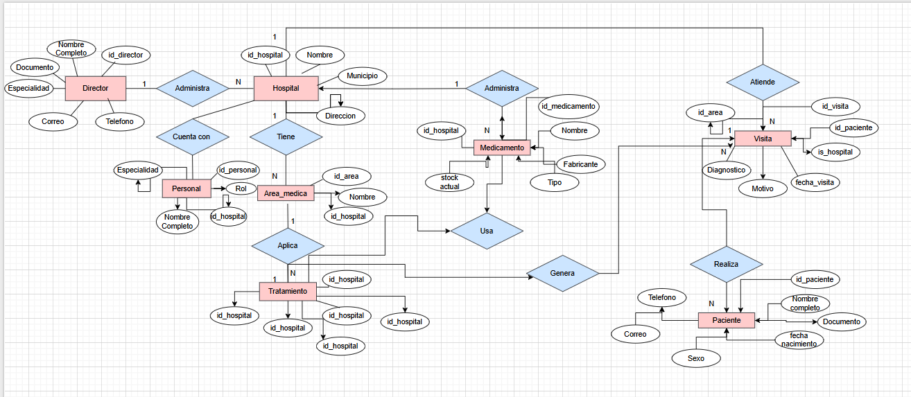

                        Proyecto MONGODB II

                     Naya Zarela Lizcano Jaimes 
                      Juan Eduardo Pinilla Guzman 

                                S1 

                      Pedro Felipe Gómez Bonilla 

                             Campus Lands 

                            Ruta NodeJS
                        Cajasan, Bucaramanga
                                2025

                      Introducción 
Este documento servirá como una guía detallada del proceso completo de diseño, estructuración e implementación de un sistema de base de datos que permita gestionar de manera eficiente todas las operaciones relacionadas con la administración de un sistema hospitalario . El objetivo principal es gestionar eficazmente la gestión de los hospitales, pacientes, médicos, tratamientos, medicamentos, visitas médicas, historiales clínicos, áreas especializadas y personal administrativo.
Inicialmente, se analizará el caso de estudio junto con sus requerimientos específicos. A partir de esta investigación, se procederá a desarrollar un modelo conceptual detallado donde se identificarán las entidades principales, sus atributos y las relaciones entre ellas. Este paso determina las bases para comprender la estructura esencial de la gestión de los hospitales de Bucaramanga.
Después de realizar el modelo conceptual, se realizará la conversión de este modelo dicho al modelo lógico. El modelo lógico  ofrece una representación más precisa de cómo se organizará la información, facilitando una comprensión clara de la base de datos en desarrollo. Se aplicará el proceso de Normalización hasta la tercera forma normal (3FN) para optimizar la organización de los datos, reduciendo redundancias y eliminando dependencias transitivas. 
Posteriormente, se llevará a cabo la conversión del modelo lógico al modelo físico, el cual define la implementación real de entidades, atributos y relaciones, incorporando detalles técnicos como los tipos de datos adecuados para cada elemento. 
Para mejorar la comprensión del sistema, se incluirá un diagrama UML que visualice de manera gráfica y concisa la estructura de la base de datos y sus relaciones. 
Finalmente, se detallarán algunos procedimientos, funciones, consultas, funciones y acceso total, la funcionalidad del sistema de información desarrollado, asegurando así su eficiencia y utilidad para la unidad de sistema hospitalario. 
Con estos pasos y elementos, se garantiza una guía completa y efectiva para el diseño y desarrollo de la base de datos necesaria para la gestión eficiente de los hospitales de Bucaramanga y su área metropolitana.

                   Caso de Estudio 
El sistema hospitalario de Bucaramanga nos ha pedido crear un diseño inicial de un Software que permita manejar los datos e información que se generan sobre los hospitales de Bucaramanga gestionados por cada municipio, por lo que comenzamos estructurando los requerimientos dados: 
Estructura del sistema
Un hospital puede tener múltiples áreas especializadas como: Cardiología, Neurología y más especialidades. 
2. Cada hospital tiene un director general, pero un director puede supervisar varios hospitales. 
3. Cada hospital tiene un conjunto de médicos, enfermeras y personal administrativo. 
4. Los hospitales deben contar con un historial detallado de pacientes y tratamientos realizados. 

Pacientes

5. Los pacientes se identifican por su número de historia clínica, nombre, dirección, teléfono correo electrónico y seguros médicos. 
6. Los historiales médicos incluyen diagnósticos, tratamientos realizados y resultados obtenidos. 

Médicos y personal 

7. Los médicos se identifican por su número de colegiatura, nombre, especialidad, teléfono, correo electrónico y salario. 

8. Se definen los siguientes tipos de personal.

001: Director General: Gestión general del hospital.

002: Médico Especialista: Atiende pacientes y realiza diagnósticos.

003: Enfermero/a: Asiste a médicos y cuida los pacientes.

004: Personal Administrativo: Gestión de recursos de logística.

005: Personal de mantenimiento: Mantenimiento y limpieza de las instalaciones.

Tratamientos y Medicamentos:

9. Los tratamientos se identifican por su nombre, descripción, área médica relacionada y costo. 
10. Los medicamentos se almacenan por nombre, fabricante, tipo y disponibilidad en inventario(stock).

Visitas Médicas:

11. Las visitas médicas se registran con fecha, hora, médico asignado, paciente atendido ydiagnóstico.

12. Los pacientes pueden tener múltiples visitas médicas a lo largo del tiempo.

Con base en la información anterior, se procederá a crear una base de datos en MONGODB y a la misma vez con funcionalidades de MYSQL esta para agrupar y relacionar los datos de los parques naturales ubicados en cada departamento, así como la información del personal y de los visitantes.

                  Instalación General
                  
Los archivos relacionados con la BBDD del Ministerio del Medio Ambiente, se encuentran en la plataforma GitHub, estos archivos se encuentran en formato json y se dividen en 4 partes: 

❖ ddl.json : Creación de la base de datos con tablas y relaciones. 

❖ dml.json: Inserciones de datos. 

❖ dql select.json : Consultas en MONGODB enfocadas en: Estado de los hospitales, inventarios de medicamentos, gestión de visitas médicas etc.

 ❖ dql funciones.json: Aquí  se gestionan las funciones en JavaScript simuladas para implementarlas como consultas reutilizables en MONGODB, se consulta cálculo de inventarios, generación de reportes de visitas médicas y obtención de estadísticas de tratamientos realizados . 

                     Planificación 
Ejecución:

Una vez se analizó la información requerida por el sistema hospitalario de Bucaramanga, se inició la creación del modelo conceptual. Este modelo proporciona una descripción de alto nivel de las necesidades de información que están detrás del diseño de una base de datos. Representa los conceptos principales de la base de datos y las relaciones entre ellos. 
Construcción del Modelo Conceptual 
Se diseñó el modelo conceptual identificando cada una de las entidades, sus atributos y las relaciones entre ellas. Este modelo conceptual proporciona una visión clara y estructurada de cómo se organizan y conectan los diferentes elementos de la base de datos. 
A continuación veremos cada una de las entidades y atributos por todos los hospitales:

Descripción 

Las Entidades y Atributos 
1. Hospital:

❖ id hospital: id único de entidad. 

❖ Nombre: nombre del hospital.

❖ Municipio: Municipio de Bucaramanga donde se encuentre cada hospital.

❖ Dirección: Dirección del hospital.

2. Director: 

❖ id_director: id único de directores. 

❖ Nombre_completo: Nombre completo del director.

❖ Documento Documento del director. 

❖ Especialidad: Especialidad del director. 

❖ Correo: Correo del director.

❖ Teléfono: Teléfono del director.

3. Área Médica: 

❖ id_area: id único del área médica.

❖ Nombre: nombre del área médica como: 
Cardiología, Neurología etc. 

❖ id_hospital : Id de cada hospital para saber en qué hospital se encuentra la especialidad o el área médica requerida. 

4. Personal_Medico: 

❖ id_personal: id del personal médico de cada hospital. 
❖ Nombre completo: nombre de cada persona que haga parte del personal médico. 

❖Rol: Rol de cada persona como Médico, Enfermero, Administrativo, Mantenimiento.

❖Especialidad: la especialidad es solo para los médicos

❖id_hospital: Id de cada hospital para saber en qué hospital se encuentran el personal. 

5. Paciente: 

❖ id_paciente : id único para cada paciente. 
❖ Nombre completo: nombre completo de cada paciente. 

❖ Documento: documento de identificación de cada paciente. 

❖ Fecha_nacimiento: fecha de nacimiento de cada paciente.

❖ Sexo: sexo femenino o masculino de cada paciente.

❖ Correo: correo electrónico de cada paciente para que obtenga información sobre lo que desee.

❖ Teléfono: teléfono ya sea celular o fijo de cada paciente para poder comunicarse con el paciente.

6. Visita:

❖ id_visita: id único de visita. 

❖ id_paciente: id del paciente ya que es único para cada paciente. 

❖ id_hospital: id del hospital para saber a cuál hospital se dirigió el paciente.
❖ Fecha_visita: fecha en la cual visitó el hospital.

❖ Motivo: motivo de visita al hospital (enfermedad, consultas etc).

❖ Diagnostico: diagnostico dado a cada paciente para conocer su estado de salud.

❖ id_área: id area para saber a cuál área del hospital se dirige o se dirigió el paciente.

7. Medicamento: 

❖ id_medicamento: id único de medicamento. 

❖ Nombre: nombre del medicamento. 

❖ Fabricante: Fabricante del medicamento. 

❖ Tipo: Tipo de medicamento. 

❖ Stock_actual: stock para conocer cuántas cantidades de medicamento hay actualmente en cada hospital. 

❖ id_hospital: id hospital para conocer en qué hospital se encuentra cada medicamento y cuanta cantidad. 

8. Tratamiento: 

❖ id_tratamiento: id único para cada tratamiento. 

❖ Nombre: nombre de cada tratamiento.

❖ Descripción: descripción de cada tratamiento.

❖ Costo: costos y precios en general para cada tratamiento.

❖id_área: id área para conocer en qué hospital se realice algún tratamiento.

❖ id_visita: id visita para conocer todas las especificaciones que se realiza en id visita.

9. Medicamento_tratamiento: 

❖ id: id único del medicamento y tratamiento.

❖ id_ tratamiento: id tratamiento para conocer el tratamiento a realizar. 

❖ id_medicamento: id medicamento para conocer el medicamento a usar. 

❖ dosis: dosis para saber cómo administrar medicamento dependiendo del tratamiento. 

❖ Frecuencia: frecuencia de la dosis de medicamento. 

               Relaciones y Cardinalidades 
Se realizó las relaciones y cardinalidades respectivas del modelo conceptual con sus entidades para tener mejor visualización de la base de datos: 
1. Director - Hospital: 

❖ Relación: "Administra", Un director puede administrar varios hospitales y cada hospital es administrado por un solo director.

❖ Cardinalidad: 1-N (uno a muchos).

2. Hospital - Área médica: 

❖ Relación: “Tiene”, un hospital tiene múltiples áreas médicas, y casa área médica pertenece a un solo hospital. 

❖ Cardinalidad: 1-N (uno a muchos). 

3. Hospital - Personal:

❖ Relación: "Cuenta con", Un hospital cuenta con muchos miembros de personal (médico, enfermeros, administrativo y  mantenimiento), y cada miembro trabaja en un solo hospital 

❖ Cardinalidad: 1-N (uno a muchos). 

4. Área Médica - Tratamiento: 

❖ Relación: “Aplica”, Un área médica aplica muchos tratamientos, y cada tratamiento está relacionado con un solo área médica. 

❖ Cardinalidad: 1-N (uno a muchos). 

5. Hospital - Medicamento: 

❖ Relación: “Administra”, Un hospital administra varios medicamentos, y cada medicamento está asignado a un solo hospital.

❖ Cardinalidad: 1-N (uno a muchos). 

6. Paciente - Visita: 

❖ Relación: “Realiza”, Un paciente puede tener muchas visitas, pero cada visita pertenece a un solo paciente. 

❖ Cardinalidad: 1-N (uno a muchos). 

7. Hospital - Visita: 

❖ Relación: “Atiende”, Un hospital atiende muchas visitas, y cada visita se realiza en un solo hospital. 

❖ Cardinalidad: 1-N (uno a muchos). 

8. Visita -  Tratamiento: 

❖ Relación: “Genera”, Una visita puede generar múltiples tratamientos, y cada tratamiento 
corresponde a una sola visita. 
❖ Cardinalidad: 1-N (uno a muchos). 

9. Tratamiento - Medicamento: 

❖ Relación: “Usa”, Un tratamiento puede requerir varios medicamentos, y un medicamento puede ser usado en muchos tratamientos. 

❖ Cardinalidad: N-M (muchos a muchos). 
Se implementa mediante la entidad intermedia “Medicamento_Tratamiento”

10. Personal_Rol Específico: 

❖ Relación: “Corresponde”, Un miembro de personal puede estar asociado a un único rol específico(médico, enfermero, administrativo, mantenimiento), y cada rol específico corresponde a un personal.

❖ Cardinalidad: 1-1 (uno a uno). 

                      Grafica:

             Construcción del Modelo Lógico 
Se ha diseñado el modelo lógico teniendo en cuenta el modelo conceptual, incorporando detalles más específicos como las características de cada atributo, incluidas las claves primarias, foráneas y las relaciones de cardinalidad. 

Descripción 

Las Entidades y Atributos 
1. Hospital :

❖ id_hospital: INT AUTO_INCREMENT PRIMARY KEY. 

❖ nombre: VARCHAR(100) NOT NULL. 

❖ ciudad: VARCHAR(100) NOT NULL.

❖ dirección: VARCHAR(200) NOT NULL.

❖ id_director: VARCHAR(100) INT NOT NULL FOREIGN KEY.

2. Director: 

❖ id_director: INT AUTO_INCREMENT PRIMARY KEY.

❖ nombre: VARCHAR (100) NOT NULL.

❖ documento: VARCHAR(20) NOT NULL. 

❖ correo VARCHAR(100) NOT NULL. 

❖ telefono: VARCHAR(20).

3. Área Médica : 

❖ id_area: INT AUTO_INCREMENT PRIMARY KEY.

❖ nombre: VARCHAR(100) NOT NULL. 

❖ id_hospital: INT NOT  NULL FOREIGN KEY.

4. Personal : 

❖ id_personal: INT PRIMARY KEY, FOREIGN KEY. 

❖ id_hospital: INT NOT NULL FOREIGN KEY. 

❖ nombre: VARCHAR(100) NOT NULL.

❖ documento: VARCHAR(20)  UNIQUE NOT NULL.

❖ rol: VARCHAR(100)  ENUM (‘Médico’, ‘Enfermero’, ‘Administrativo’, ‘Mantenimiento’) NOT NULL.

❖ especialidad: VARCHAR(100) 

❖ correo: VARCHAR(100) 

❖ telefono: VARCHAR(20) 

5. Paciente: 

❖ id_paciente: INT AUTO_INCREMENT PRIMARY KEY.

❖ nombre: VARCHAR (100) NOT NULL. 

❖ documento: VARCHAR(20)  UNIQUE NOT NULL. 

❖ fecha_nacimiento: DATE NOT NULL. 

❖ sexo: varchar ENUM (‘M’, ‘F’) NOT NULL.

❖ correo: varchar(100).

❖ telefono: VARCHAR (20).

6. Visita : 

❖ id_visita INT AUTO_INCREMENT PRIMARY KEY.

❖ id_paciente: INT NOT NULL FOREIGN KEY. 

❖  id_hospital: INT NOT NULL FOREIGN KEY. 

❖  id_area: INT NOT NULL FOREIGN KEY. 

❖ fecha_visita: DATE NOT NULL. 

❖ motivo: VARCHAR (100) NOT NULL. 

❖ diagnóstico: TEXT.

7. Tratamiento  : 

❖ id_tratamiento: INT AUTO_INCREMENT PRIMARY KEY. 

❖ id_visita: INT NOT NULL FOREIGN KEY.

❖ id_area: INT(20) INT NOT NULL FOREIGN KEY. 

❖ nombre: VARCHAR(100) NOT NULL. 

❖ descripcion: TEXT. 

❖ costo: DECIMAL (10,2) NOT NULL.

8. Medicamento : 

❖ id_medicamento: INT AUTO_INCREMENT PRIMARY KEY. 

❖ id_hospital: INT NOT NULL FOREIGN KEY.

❖ nombre: VARCHAR (100) NOT NULL.

❖ fabricante: VARCHAR (100) NOT NULL.

❖ tipo: VARCHAR (50) NOT NULL. 

❖ stock_actual: INT (10) NOT NULL. 

9. Medicamento_tratamiento : 

❖ id_tratamiento: INT AUTO_INCREMENT PRIMARY KEY. 

❖ id_medicamento: INT NOT NULL FOREIGN KEY.

❖ dosis:  VARCHAR (50) NOT NULL. 

❖ frecuencia: VARCHAR(100) NOT NULL. 

❖ marca_vehiculo: VARCHAR(50) NOT NULL. 

              Relaciones y Cardinalidades 
Se realizó las relaciones y cardinalidades respectivas del modelo lógico con sus entidades para tener mejor visualización de la base de datos: 
1. Director- Hospital: 

❖ Un director administra varios hospitales, pero un hospital solo tiene un director

❖Cardinalidad: 1-N (uno a muchos).

2. Hospital - Area Medica: 

❖Un hospital tiene varias areas, y cada area medica pertenece a un solo hospital.

❖ Cardinalidad: 1-N (uno a muchos).

3. Hospital- Personal: 

❖ Un hospital cuenta con muchos trabajadores, y cada uno pertenece a un solo hospital.

❖ Cardinalidad: 1-N (uno a muchos).

4. Hospital - Medicamento: 

❖Un hospital almacena múltiples medicamentos, y cada medicamento está registrado en un hospital. 

❖ Cardinalidad: 1-N (uno a muchos).

5. Paciente - Visita: 

❖Un paciente puede tener muchas visitas, y cada visita pertenece a un solo paciente.

❖ Cardinalidad: 1-N (uno a muchos).

6. Hospital - Visita: 

❖Un hospital atiende muchas visitas, cada una realizada en un solo hospital.

❖ Cardinalidad: 1-N (uno a muchos).

7. Área Médica - Visita: 

❖ Una visita se registra bajo un área médica especifica, y un área puede tener muchas visitas. 

❖ Cardinalidad: 1-N (uno a muchos).

8. Visita - Tratamiento: 
❖ Una visita puede generar varios tratamientos, pero un tratamiento pertenece a una sola visita. 

❖ Cardinalidad: 1-N (uno a muchos).

9. Área Médica - Tratamiento :

❖ Cada tratamiento se asocia a un área médica, y un área médica puede aplicar varios tratamientos. 

❖ Cardinalidad: 1-N (uno a muchos).

10. Tratamiento - Medicamento:

❖Un tratamiento puede usar muchos medicamentos, y un medicamento puede ser utilizado en muchos tratamientos.

❖ Cardinalidad: N- M ( muchos a muchos). 

❖ Entidad intermedia: medicamento_tratamiento.

                      Gráfica
                     

Modelo lógico:

modelo

