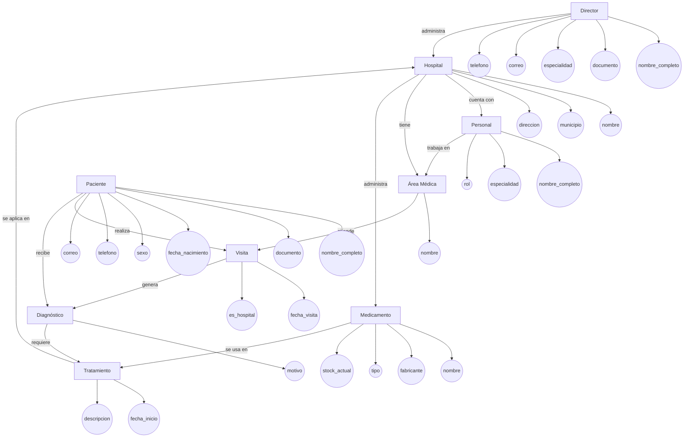
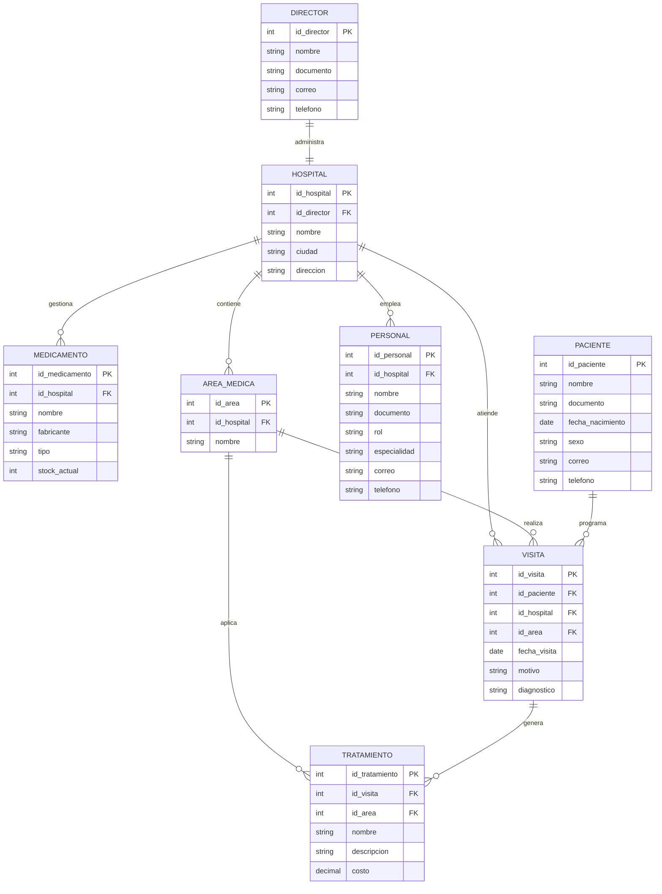
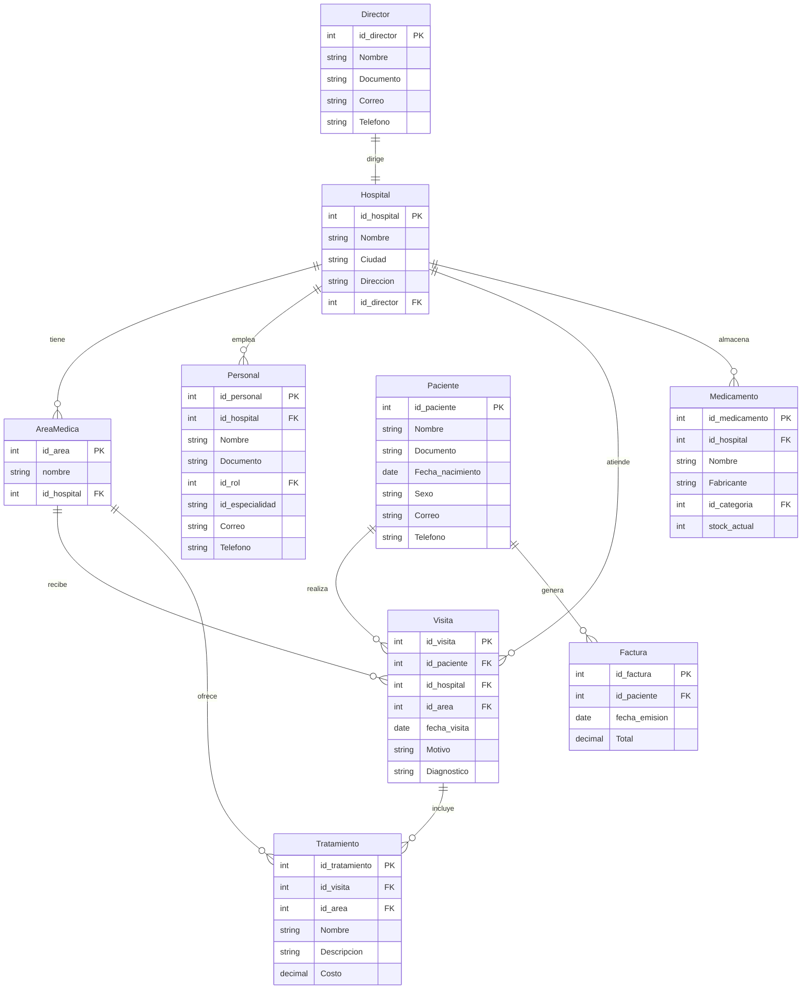
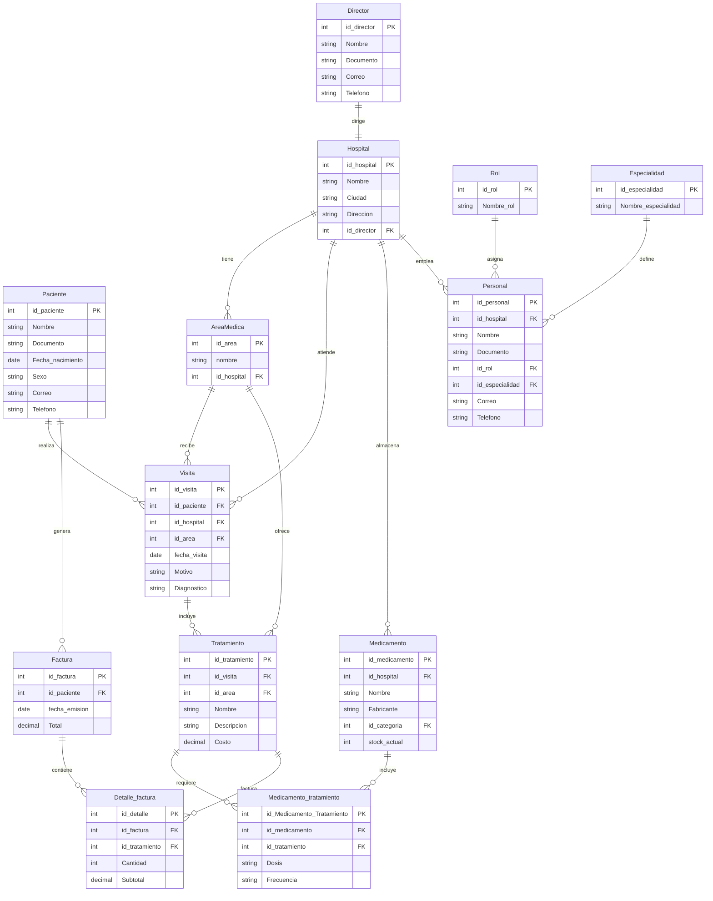

## Sistema Hospitalario MongoDB 🏥


## Introducción 
Este documento servirá como una guía detallada del proceso completo de diseño, estructuración e implementación de un sistema de base de datos que permita gestionar de manera eficiente todas las operaciones relacionadas con la administración de un sistema hospitalario . El objetivo principal es gestionar eficazmente la gestión de los hospitales, pacientes, médicos, tratamientos, medicamentos, visitas médicas, historiales clínicos, áreas especializadas y personal administrativo.
Inicialmente, se analizará el caso de estudio junto con sus requerimientos específicos. A partir de esta investigación, se procederá a desarrollar un modelo conceptual detallado donde se identificarán las entidades principales, sus atributos y las relaciones entre ellas. Este paso determina las bases para comprender la estructura esencial de la gestión de los hospitales de Bucaramanga.
Después de realizar el modelo conceptual, se realizará la conversión de este modelo dicho al modelo lógico. El modelo lógico  ofrece una representación más precisa de cómo se organizará la información, facilitando una comprensión clara de la base de datos en desarrollo. Se aplicará el proceso de Normalización hasta la tercera forma normal (3FN) para optimizar la organización de los datos, reduciendo redundancias y eliminando dependencias transitivas. 
Posteriormente, se llevará a cabo la conversión del modelo lógico al modelo físico, el cual define la implementación real de entidades, atributos y relaciones, incorporando detalles técnicos como los tipos de datos adecuados para cada elemento. 
Para mejorar la comprensión del sistema, se incluirá un diagrama UML que visualice de manera gráfica y concisa la estructura de la base de datos y sus relaciones. 
Finalmente, se detallarán algunos procedimientos, funciones, consultas, funciones y acceso total, la funcionalidad del sistema de información desarrollado, asegurando así su eficiencia y utilidad para la unidad de sistema hospitalario. 
Con estos pasos y elementos, se garantiza una guía completa y efectiva para el diseño y desarrollo de la base de datos necesaria para la gestión eficiente de los hospitales de Bucaramanga y su área metropolitana.

## Caso de Estudio 
El sistema hospitalario de Bucaramanga nos ha pedido crear un diseño inicial de un Software que permita manejar los datos e información que se generan sobre los hospitales de Bucaramanga gestionados por cada municipio, por lo que comenzamos estructurando los requerimientos dados: 
Estructura del sistema
Un hospital puede tener múltiples áreas especializadas como: Cardiología, Neurología y más especialidades. 
2. Cada hospital tiene un director general, pero un director puede supervisar varios hospitales. 
3. Cada hospital tiene un conjunto de médicos, enfermeras y personal administrativo. 
4. Los hospitales deben contar con un historial detallado de pacientes y tratamientos realizados. 

Pacientes

5. Los pacientes se identifican por su número de historia clínica, nombre, dirección, teléfono correo electrónico y seguros médicos. 
6. Los historiales médicos incluyen diagnósticos, tratamientos realizados y resultados obtenidos. 

Médicos y personal 

7. Los médicos se identifican por su número de colegiatura, nombre, especialidad, teléfono, correo electrónico y salario. 

8. Se definen los siguientes tipos de personal.

001: Director General: Gestión general del hospital.

002: Médico Especialista: Atiende pacientes y realiza diagnósticos.

003: Enfermero/a: Asiste a médicos y cuida los pacientes.

004: Personal Administrativo: Gestión de recursos de logística.

005: Personal de mantenimiento: Mantenimiento y limpieza de las instalaciones.

Tratamientos y Medicamentos:

9. Los tratamientos se identifican por su nombre, descripción, área médica relacionada y costo. 
10. Los medicamentos se almacenan por nombre, fabricante, tipo y disponibilidad en inventario(stock).

Visitas Médicas:

11. Las visitas médicas se registran con fecha, hora, médico asignado, paciente atendido ydiagnóstico.

12. Los pacientes pueden tener múltiples visitas médicas a lo largo del tiempo.


Con base en la información anterior, se procederá a crear una base de datos en MONGODB y a la misma vez con funcionalidades de MYSQL esta para agrupar y relacionar los datos de los parques naturales ubicados en cada departamento, así como la información del personal y de los visitantes.

## Instalación General

Los archivos relacionados con la BBDD del Ministerio del Medio Ambiente, se encuentran en la plataforma GitHub, estos archivos se encuentran en formato json y se dividen en 4 partes: 

❖ ddl.json : Creación de la base de datos con tablas y relaciones. 

❖ dml.json: Inserciones de datos. 

❖ dql select.json : Consultas en MONGODB enfocadas en: Estado de los hospitales, inventarios de medicamentos, gestión de visitas médicas etc.

 ❖ dql funciones.json: Aquí  se gestionan las funciones en JavaScript simuladas para implementarlas como consultas reutilizables en MONGODB, se consulta cálculo de inventarios, generación de reportes de visitas médicas y obtención de estadísticas de tratamientos realizados . 

## Planificación 
Ejecución:

Una vez se analizó la información requerida por el sistema hospitalario de Bucaramanga, se inició la creación del modelo conceptual. Este modelo proporciona una descripción de alto nivel de las necesidades de información que están detrás del diseño de una base de datos. Representa los conceptos principales de la base de datos y las relaciones entre ellos. 
Construcción del Modelo Conceptual 
Se diseñó el modelo conceptual identificando cada una de las entidades, sus atributos y las relaciones entre ellas. Este modelo conceptual proporciona una visión clara y estructurada de cómo se organizan y conectan los diferentes elementos de la base de datos. 
A continuación veremos cada una de las entidades y atributos por todos los hospitales:

## Descripción 

Las Entidades y Atributos 
1. Hospital:

❖ id hospital: id único de entidad. 

❖ Nombre: nombre del hospital.

❖ Municipio: Municipio de Bucaramanga donde se encuentre cada hospital.

❖ Dirección: Dirección del hospital.


2. Director: 

❖ id_director: id único de directores. 

❖ Nombre_completo: Nombre completo del director.

❖ Documento Documento del director. 

❖ Especialidad: Especialidad del director. 

❖ Correo: Correo del director.

❖ Teléfono: Teléfono del director.

3. Área Médica: 

❖ id_area: id único del área médica.

❖ Nombre: nombre del área médica como: 
Cardiología, Neurología etc. 

❖ id_hospital : Id de cada hospital para saber en qué hospital se encuentra la especialidad o el área médica requerida. 

4. Personal_Medico: 

❖ id_personal: id del personal médico de cada hospital. 
❖ Nombre completo: nombre de cada persona que haga parte del personal médico. 

❖Rol: Rol de cada persona como Médico, Enfermero, Administrativo, Mantenimiento.

❖Especialidad: la especialidad es solo para los médicos

❖id_hospital: Id de cada hospital para saber en qué hospital se encuentran el personal. 


5. Paciente: 

❖ id_paciente : id único para cada paciente. 
❖ Nombre completo: nombre completo de cada paciente. 

❖ Documento: documento de identificación de cada paciente. 

❖ Fecha_nacimiento: fecha de nacimiento de cada paciente.

❖ Sexo: sexo femenino o masculino de cada paciente.

❖ Correo: correo electrónico de cada paciente para que obtenga información sobre lo que desee.

❖ Teléfono: teléfono ya sea celular o fijo de cada paciente para poder comunicarse con el paciente.

6. Visita:

❖ id_visita: id único de visita. 

❖ id_paciente: id del paciente ya que es único para cada paciente. 

❖ id_hospital: id del hospital para saber a cuál hospital se dirigió el paciente.
❖ Fecha_visita: fecha en la cual visitó el hospital.

❖ Motivo: motivo de visita al hospital (enfermedad, consultas etc).

❖ Diagnostico: diagnostico dado a cada paciente para conocer su estado de salud.

❖ id_área: id area para saber a cuál área del hospital se dirige o se dirigió el paciente.

7. Medicamento: 

❖ id_medicamento: id único de medicamento. 

❖ Nombre: nombre del medicamento. 

❖ Fabricante: Fabricante del medicamento. 

❖ Tipo: Tipo de medicamento. 

❖ Stock_actual: stock para conocer cuántas cantidades de medicamento hay actualmente en cada hospital. 

❖ id_hospital: id hospital para conocer en qué hospital se encuentra cada medicamento y cuanta cantidad. 

8. Tratamiento: 

❖ id_tratamiento: id único para cada tratamiento. 

❖ Nombre: nombre de cada tratamiento.

❖ Descripción: descripción de cada tratamiento.

❖ Costo: costos y precios en general para cada tratamiento.

❖id_área: id área para conocer en qué hospital se realice algún tratamiento.

❖ id_visita: id visita para conocer todas las especificaciones que se realiza en id visita.

9. Medicamento_tratamiento: 

❖ id: id único del medicamento y tratamiento.

❖ id_ tratamiento: id tratamiento para conocer el tratamiento a realizar. 

❖ id_medicamento: id medicamento para conocer el medicamento a usar. 

❖ dosis: dosis para saber cómo administrar medicamento dependiendo del tratamiento. 

❖ Frecuencia: frecuencia de la dosis de medicamento. 

## Relaciones y Cardinalidades 
Se realizó las relaciones y cardinalidades respectivas del modelo conceptual con sus entidades para tener mejor visualización de la base de datos: 
1. Director - Hospital: 

❖ Relación: "Administra", Un director puede administrar varios hospitales y cada hospital es administrado por un solo director.

❖ Cardinalidad: 1-N (uno a muchos).

2. Hospital - Área médica: 

❖ Relación: “Tiene”, un hospital tiene múltiples áreas médicas, y casa área médica pertenece a un solo hospital. 

❖ Cardinalidad: 1-N (uno a muchos). 

3. Hospital - Personal:

❖ Relación: "Cuenta con", Un hospital cuenta con muchos miembros de personal (médico, enfermeros, administrativo y  mantenimiento), y cada miembro trabaja en un solo hospital 

❖ Cardinalidad: 1-N (uno a muchos). 

4. Área Médica - Tratamiento: 

❖ Relación: “Aplica”, Un área médica aplica muchos tratamientos, y cada tratamiento está relacionado con un solo área médica. 

❖ Cardinalidad: 1-N (uno a muchos). 

5. Hospital - Medicamento: 

❖ Relación: “Administra”, Un hospital administra varios medicamentos, y cada medicamento está asignado a un solo hospital.

❖ Cardinalidad: 1-N (uno a muchos). 

6. Paciente - Visita: 

❖ Relación: “Realiza”, Un paciente puede tener muchas visitas, pero cada visita pertenece a un solo paciente. 

❖ Cardinalidad: 1-N (uno a muchos). 


7. Hospital - Visita: 

❖ Relación: “Atiende”, Un hospital atiende muchas visitas, y cada visita se realiza en un solo hospital. 

❖ Cardinalidad: 1-N (uno a muchos). 


8. Visita -  Tratamiento: 

❖ Relación: “Genera”, Una visita puede generar múltiples tratamientos, y cada tratamiento 
corresponde a una sola visita. 
❖ Cardinalidad: 1-N (uno a muchos). 


9. Tratamiento - Medicamento: 

❖ Relación: “Usa”, Un tratamiento puede requerir varios medicamentos, y un medicamento puede ser usado en muchos tratamientos. 

❖ Cardinalidad: N-M (muchos a muchos). 
Se implementa mediante la entidad intermedia “Medicamento_Tratamiento”


10. Personal_Rol Específico: 

❖ Relación: “Corresponde”, Un miembro de personal puede estar asociado a un único rol específico(médico, enfermero, administrativo, mantenimiento), y cada rol específico corresponde a un personal.

❖ Cardinalidad: 1-1 (uno a uno). 
## Grafica:




## Construcción del Modelo Lógico 
Se ha diseñado el modelo lógico teniendo en cuenta el modelo conceptual, incorporando detalles más específicos como las características de cada atributo, incluidas las claves primarias, foráneas y las relaciones de cardinalidad. 

## Descripción 

Las Entidades y Atributos 
1. Hospital :

❖ id_hospital: INT AUTO_INCREMENT PRIMARY KEY. 

❖ nombre: VARCHAR(100) NOT NULL. 

❖ ciudad: VARCHAR(100) NOT NULL.

❖ dirección: VARCHAR(200) NOT NULL.

❖ id_director: VARCHAR(100) INT NOT NULL FOREIGN KEY.


2. Director: 

❖ id_director: INT AUTO_INCREMENT PRIMARY KEY.

❖ nombre: VARCHAR (100) NOT NULL.

❖ documento: VARCHAR(20) NOT NULL. 

❖ correo VARCHAR(100) NOT NULL. 

❖ telefono: VARCHAR(20).

3. Área Médica : 

❖ id_area: INT AUTO_INCREMENT PRIMARY KEY.

❖ nombre: VARCHAR(100) NOT NULL. 

❖ id_hospital: INT NOT  NULL FOREIGN KEY.

4. Personal : 

❖ id_personal: INT PRIMARY KEY, FOREIGN KEY. 

❖ id_hospital: INT NOT NULL FOREIGN KEY. 

❖ Nombre: VARCHAR(100) NOT NULL.

❖ Documento: VARCHAR(20)  UNIQUE NOT NULL.

❖ Rol: VARCHAR(100)  ENUM (‘Médico’, ‘Enfermero’, ‘Administrativo’, ‘Mantenimiento’) NOT NULL.

❖ Especialidad: VARCHAR(100) 

❖ Correo: VARCHAR(100) 

❖ Telefono: VARCHAR(20) 

5. Paciente: 

❖ id_paciente: INT AUTO_INCREMENT PRIMARY KEY.

❖ nombre: VARCHAR (100) NOT NULL. 

❖ documento: VARCHAR(20)  UNIQUE NOT NULL. 

❖ fecha_nacimiento: DATE NOT NULL. 

❖ sexo: varchar ENUM (‘M’, ‘F’) NOT NULL.

❖ correo: varchar(100).

❖ telefono: VARCHAR (20).

6. Visita : 

❖ id_visita INT AUTO_INCREMENT PRIMARY KEY.

❖ id_paciente: INT NOT NULL FOREIGN KEY. 

❖  id_hospital: INT NOT NULL FOREIGN KEY. 

❖  id_area: INT NOT NULL FOREIGN KEY. 

❖ fecha_visita: DATE NOT NULL. 

❖ motivo: VARCHAR (100) NOT NULL. 

❖ diagnóstico: TEXT.

7. Tratamiento  : 

❖ id_tratamiento: INT AUTO_INCREMENT PRIMARY KEY. 

❖ id_visita: INT NOT NULL FOREIGN KEY.

❖ id_area: INT(20) INT NOT NULL FOREIGN KEY. 

❖ nombre: VARCHAR(100) NOT NULL. 

❖ descripcion: TEXT. 

❖ costo: DECIMAL (10,2) NOT NULL.


8. Medicamento : 

❖ id_medicamento: INT AUTO_INCREMENT PRIMARY KEY. 

❖ id_hospital: INT NOT NULL FOREIGN KEY.

❖ nombre: VARCHAR (100) NOT NULL.

❖ fabricante: VARCHAR (100) NOT NULL.

❖ tipo: VARCHAR (50) NOT NULL. 

❖ stock_actual: INT (10) NOT NULL. 


9. Medicamento_tratamiento : 

❖ id_tratamiento: INT AUTO_INCREMENT PRIMARY KEY. 

❖ id_medicamento: INT NOT NULL FOREIGN KEY.

❖ dosis:  VARCHAR (50) NOT NULL. 

❖ frecuencia: VARCHAR(100) NOT NULL. 

❖ marca_vehiculo: VARCHAR(50) NOT NULL. 

## Relaciones y Cardinalidades 
Se realizó las relaciones y cardinalidades respectivas del modelo lógico con sus entidades para tener mejor visualización de la base de datos: 
1. Director- Hospital: 

❖ Un director administra varios hospitales, pero un hospital solo tiene un director

❖Cardinalidad: 1-N (uno a muchos).

2. Hospital - Area Medica: 

❖Un hospital tiene varias areas, y cada area medica pertenece a un solo hospital.

❖ Cardinalidad: 1-N (uno a muchos).

3. Hospital- Personal: 

❖ Un hospital cuenta con muchos trabajadores, y cada uno pertenece a un solo hospital.

❖ Cardinalidad: 1-N (uno a muchos).

4. Hospital - Medicamento: 

❖Un hospital almacena múltiples medicamentos, y cada medicamento está registrado en un hospital. 

❖ Cardinalidad: 1-N (uno a muchos).

5. Paciente - Visita: 

❖Un paciente puede tener muchas visitas, y cada visita pertenece a un solo paciente.

❖ Cardinalidad: 1-N (uno a muchos).

6. Hospital - Visita: 

❖Un hospital atiende muchas visitas, cada una realizada en un solo hospital.

❖ Cardinalidad: 1-N (uno a muchos).

7. Área Médica - Visita: 

❖ Una visita se registra bajo un área médica especifica, y un área puede tener muchas visitas. 

❖ Cardinalidad: 1-N (uno a muchos).

8. Visita - Tratamiento: 
❖ Una visita puede generar varios tratamientos, pero un tratamiento pertenece a una sola visita. 

❖ Cardinalidad: 1-N (uno a muchos).

9. Área Médica - Tratamiento :

❖ Cada tratamiento se asocia a un área médica, y un área médica puede aplicar varios tratamientos. 

❖ Cardinalidad: 1-N (uno a muchos).

10. Tratamiento - Medicamento:

❖Un tratamiento puede usar muchos medicamentos, y un medicamento puede ser utilizado en muchos tratamientos.

❖ Cardinalidad: N- M ( muchos a muchos). 

❖ Entidad intermedia: medicamento_tratamiento.

## Gráfica



## Normalización del Modelo Lógico 

Se realizó el proceso de la normalización de las tablas anteriormente visualizadas para organizar los datos de manera más eficiente,minimizando redundancias y dependencias transitivas en la base de datos en desarrollo. 

## Primera Forma Normal (1FN) 

Una tabla está en 1FN si cumple con los siguientes criterios: 

❖ Todos los atributos contienen valores atómicos (indivisibles). 

❖ No debe haber grupos repetitivos de columnas.

❖ Cada columna debe contener un solo valor en cada fila. 

## Descripción 
La primera forma normal, es el primer nivel de normalización en el diseño de la base de datos que se aplicará a las tablas de la base de datos para garantizar la organización de los datos de manera que evite redundancias y asegure la consistencia de la información. 

## Descripción Técnica 

1. Hospital : 

❖ Se encuentra en 1FN, ya que cuenta con una clave primaria única y cada columna tiene valores atómicos.

2. Director : 

❖ Se encuentra en 1FN, cumple con unicidad en su clave primaria y los atrbutosno son multivaluados.

3. Area_medica : 

❖ Se encuentra en 1FN,todos los valores son indivisibles. 

4. Personal: 

❖ Se encuentra en 1FN, sus atributos son únicos por fila y no hay columnas multivaluadas. 

5. Paciente:

❖ Se encuentra en 1FN, los datos principales están bien estructuradas. 

6. Visita: 

❖ Se encuentra en 1FN, cada visita representa un evento único y los campos son atómicos. 

7. Tratamiento: 

❖ Se encuentra en 1FN, todos los valores son unicos por fila.

8. Medicamento: 
❖ Se encuentra en 1FN, sin atributos repetitivos o compuestos.

9. Medicamento_tratamiento: 

❖ Se encuentra en 1FN, representa una relacion M:N, bien estructurada con claves compuestas. 

9. Factura: 
❖ Se encuentra en 1FN, ya que cada factura tiene una clave primaria única (id_factura) y los atributos son atómicos, sin grupos repetitivos.

## Gráfica



## Segunda Forma Normal (2FN) 

Una tabla está en 2FN si cumple con los siguientes criterios: 

❖ Está en 1FN. 

❖ Todos los atributos no clave (no pertenecientes a una clave primaria compuesta) dependen completamente de la clave primaria. 
## Descripción 
La segunda forma normal, es el segundo nivel de normalización en el diseño de la base de datos que se aplicará a las tablas de una base de datos que ya cumplen con la primera forma normal y lleva a cabo la eliminación de dependencias parciales dentro de una tabla. 

## Descripción Técnica 

1. Hospital :

❖ Esta en 2FN ya que todos los atributos dependen únicamente del id_hospital. 

2. Director: 

❖ Se encuentra en 2FN, sin claves compuestas ni dependencias parciales. 

3. Area_medica : 

❖ Se encuentra en 2FN, ya que depende totalmente de id_area. 
4. Personal: 

❖ Se encuentra en 2FN, atributos como nombre, documento y rol dependen totalmente de id_personal. 

5. Paciente : 

❖ Se encuentra en 2FN, ya que cada columna depende completamente de su clave primaria. 

6. Visita : 

❖ Se encuentra en 2FN, ya que el diagnóstico, fecha y visita dependen de id_visita. 

7. Tratamiento :  

❖ Se encuentra en 2FN, ya que nombre, descripción, costo dependen totalmente de la clave id_tratamiento . 

8. : Medicamento:

❖ Se encuentra en 2FN, los atributos son función directa de la clave primaria. 

9. Medicamento_tratamiento : 

❖ Se encuentra en 2FN, ya que cada columna depende de la combinacion 

10. Factura: 

❖ Se encuentra en 2FN, ya que cada atributo (fecha_emision, total) depende completamente de la clave primaria y no existen claves compuestas.

11. Detalle_Factura:

❖ Se encuentra en 2FN, ya que los atributos no clave (cantidad, subtotal) dependen por completo de la clave primaria (id_detalle).

12. Rol:

❖ Se encuentra en 2FN, ya que el atributo nombre_rol depende totalmente de la clave primaria.

13. Especialidad:

❖ Se encuentra en 2FN, ya que el atributo nombre_especialidad depende solo de la clave primaria.

## Gráfica



´´´

## Tercera Forma Normal (3FN) 
Una tabla está en 3NF si cumple con los siguientes criterios: 

❖ Está en 2NF. 

❖ No hay dependencias transitivas: ningún atributo no clave depende de otro atributo no clave. 

## Descripción 
La tercera forma normal, es el tercer nivel de normalización en el diseño de la base de datos que se aplicará a las tablas de una base de datos que ya cumplen con la segunda forma normal y se enfoca en la eliminación de dependencias transitivas, evitando que un atributo no clave dependa de otro no clave.

## Descripción Técnica 
1. Hospital: 

❖ Se encuentra en 3FN, ya que no existen dependencias con atributos no clave.. 

2. Director: 

❖ Se encuentra en 3FN, ya que los datos de contacto no dependen entre si.

3. Area_medica : 

❖ Se encuentra en 3FN, ya que no tiene transacciones entre atributos no clave. 

4. Personal : 

Se encuentra en 3FN, ya que rol, especialidad, correo, etc, no dependen entre si. 

5. Paciente : 

❖ Se encuentra en 3FN, no hay relaciones transitivas entre los atributos de la tabla. 

6. Visita: 

❖ Se encuentra en 3FN, motivo y diagnostico dependen solo de la visita, no de paciente o hospital . 

7. Tratamiento: 

❖ Se encuentra en 3FN, ya que no hay atributos no clave relacionados entre si. 

8. Medicamento : 

❖ Se encuentra en 3FN, ya  que todos los campos son dependientes directos de la clave.

9. Medicamento_tratamiento : 

❖ Se encuentra en 3FN, ya que la dosis y frecuencia dependen de la clave compuesta. 

10. Factura:
❖ Se encuentra en 3FN, ya que no hay dependencias transitivas entre atributos; el total y la fecha dependen solo de la clave primaria.

11. Detalle_Factura:

❖ Se encuentra en 3FN, ya que no existen dependencias transitivas; la relación con Factura y Tratamiento está normalizada mediante claves foráneas.


12. Rol:

❖ Se encuentra en 3FN, ya que no existen dependencias transitivas; todos los atributos dependen únicamente de id_especialidad.

13. Especialidad:

❖ Se encuentra en 3FN, ya que la dosis y frecuencia dependen de la clave compuesta. 

14. Categoria_Medicamento:

❖ Se encuentra en 3FN, ya que no hay dependencias transitivas; el nombre de la categoría depende únicamente de la clave primaria.


15. Historia_Tratamiento

❖ Se encuentra en 3FN, ya que no hay dependencias transitivas; las fechas y el estado dependen únicamente de la clave primaria y están normalizadas respecto al tratamiento.

## Gráfica



```mermaid
erDiagram
    Paciente {
        int id_paciente PK
        string nombre
        string documento
        date fecha_nacimiento
        string sexo
        string correo
        string telefono
    }
    
    Factura {
        int id_factura PK
        int id_paciente FK
        date fecha_emision
        decimal total
    }
    
    Detalle_factura {
        int id_detalle PK
        int id_factura FK
        int id_tratamiento FK
        int cantidad
        decimal subtotal
    }
    
    Historia_tratamiento {
        int id_historia_tratamiento PK
        int id_paciente FK
        int id_tratamiento FK
        date fecha_inicio
        date fecha_fin
    }
    
    Tratamiento {
        int id_tratamiento PK
        int id_visita FK
        int id_area FK
        string nombre
        string descripcion
        decimal costo
    }
    
    Visita {
        int id_visita PK
        int id_paciente FK
        int id_hospital FK
        int id_area FK
        date fecha_visita
        string motivo
        string diagnostico
    }
    
    AreaMedica {
        int id_area PK
        string nombre
        int id_hospital FK
    }
    
    Hospital {
        int id_hospital PK
        string nombre
        string ciudad
        string direccion
        int id_director FK
    }
    
    Director {
        int id_director PK
        string nombre
        string documento
        string correo
        string telefono
    }
    
    Personal {
        int id_personal PK
        int id_hospital FK
        string nombre
        string documento
    }
    
    Rol {
        int id_rol PK
        string nombre_rol
    }
    
    Especialidad {
        int id_especialidad PK
        string nombre_especialidad
        string correo
        string telefono
    }
    
    Medicamento {
        int id_medicamento PK
        int id_hospital FK
        string nombre
        string fabricante
        int id_categoria FK
        int stock_actual
    }
    
    Categoria_Medicamento {
        int id_categoria_medic PK
        string nombre_categoria
    }
    
    Medicamento_tratamiento {
        int id_Medicamento_Tratamiento PK
        int id_medicamento FK
        int id_tratamiento FK
        string dosis
        string frecuencia
    }

    %% Relaciones
    Paciente ||--o{ Factura : "tiene"
    Paciente ||--o{ Historia_tratamiento : "posee"
    Paciente ||--o{ Visita : "realiza"
    
    Factura ||--o{ Detalle_factura : "contiene"
    Detalle_factura }o--|| Tratamiento : "incluye"
    
    Historia_tratamiento }o--|| Tratamiento : "registra"
    
    Visita }o--|| Hospital : "se_realiza_en"
    Visita }o--|| AreaMedica : "corresponde_a"
    Visita ||--o{ Tratamiento : "genera"
    
    AreaMedica }o--|| Hospital : "pertenece_a"
    
    Hospital }o--|| Director : "dirigido_por"
    Hospital ||--o{ Personal : "emplea"
    Hospital ||--o{ Medicamento : "almacena"
    
    Personal }o--|| Rol : "tiene_rol"
    Personal }o--|| Especialidad : "tiene_especialidad"
    
    Medicamento }o--|| Categoria_Medicamento : "pertenece_a"
    Medicamento ||--o{ Medicamento_tratamiento : "usado_en"
    
    Tratamiento ||--o{ Medicamento_tratamiento : "requiere"
```

## Construcción del Modelo Físico:

Se diseñó el modelo físico considerando el modelo lógico que incluye todas las entidades, sus atributos y las relaciones entre ellas. Además, este modelo incorpora los tipos de datos de los atributos previamente definidos, los cuales fueron estructurados en tablas utilizando el lenguaje de un Sistema de Gestión de Bases en MONGODB .

## Descripción 

El modelo físico se diseñó para funcionar en MONGODB, donde se haran 100 consultas enfocadas en toda el sistema hospitalario. 
Creación de colecciones
Para crear la base de datos utilice el siguiente comando: 
create database Hospitales; 
Para utilizar cada colección use: 
use Hospitales; 
Comenzaremos creando las colecciones de cada apartado de los hospitales: 

1. Creación de la colección directores:
```js
db.createCollection("directores", {
  validator: {
    $jsonSchema: {
      bsonType: "object",
      required: ["_id", "nombre", "documento", "correo", "telefono"],
      properties: {
        _id: { bsonType: "string" },
        nombre: { bsonType: "string" },
        documento: { bsonType: "string" },
        correo: { bsonType: "string" },
        telefono: { bsonType: "string" }
      }
    }
  }
});
```

* Insertar datos a la coleccion ("directores):
```js
db.directores.insertMany([
  {
    "_id": "DIR001",
    "nombre": "Dr. Carlos Alberto Mendoza Rivera",
    "documento": "12345678",
    "correo": "carlos.mendoza@hospitales.gov.co",
    "telefono": "3001234567"
  },
  {
    "_id": "DIR002", 
    "nombre": "Dra. María Elena Rodríguez Vargas",
    "documento": "87654321",
    "correo": "maria.rodriguez@hospitales.gov.co",
    "telefono": "3007654321"
  },
  {
    "_id": "DIR003",
    "nombre": "Dr. José Antonio Vargas Herrera",
    "documento": "11223344",
    "correo": "jose.vargas@hospitales.gov.co", 
    "telefono": "3001122334"
  }
]);
```
2. Creación de la colección hospitales :
```js
db.createCollection("hospitales", {
  validator: {
    $jsonSchema: {
      bsonType: "object",
      required: ["_id", "nombre", "ciudad", "direccion", "id_director"],
      properties: {
        _id: { bsonType: "string" },
        nombre: { bsonType: "string" },
        ciudad: { bsonType: "string" },
        direccion: { bsonType: "string" },
        id_director: { bsonType: "string" }
      }
    }
  }
});
```

* Insertar datos a la coleccion ("hospitales"):
```js
db.hospitales.insertMany([ {
      "id_hospital": "HOS001",
      "nombre": "Hospital Universitario de Santander (HUS)",
      "ciudad": "Bucaramanga",
      "direccion": "Carrera 33 #28-126",
      "id_director": "DIR001"
    },
    {
      "id_hospital": "HOS002", 
      "nombre": "Hospital Universitario Los Comuneros",
      "ciudad": "Bucaramanga",
      "direccion": "Autopista Floridablanca Km 1",
      "id_director": "DIR001"
    },
    {
      "id_hospital": "HOS003",
      "nombre": "E.S.E. Hospital San Juan de Dios de Floridablanca",
      "ciudad": "Floridablanca", 
      "direccion": "Calle 4 #11-50",
      "id_director": "DIR002"
    },
    {
      "id_hospital": "HOS004",
      "nombre": "Hospital Internacional de Colombia",
      "ciudad": "Bucaramanga",
      "direccion": "Calle 155 #23-09",
      "id_director": "DIR003"
    }
]);
```

3. Creación de la colección roles :
```js
db.createCollection("roles", {
  validator: {
    $jsonSchema: {
      bsonType: "object",
      required: ["_id", "nombre_rol"],
      properties: {
        _id: { bsonType: "string" },
        nombre_rol: { bsonType: "string" }
      }
    }
  }
});
```

* Insertar datos a la coleccion ("roles"):
```js
db.roles.insertMany([ {
      "id_hospital": "HOS001",
      "nombre": "Hospital Universitario de Santander (HUS)",
      "ciudad": "Bucaramanga",
      "direccion": "Carrera 33 #28-126",
      "id_director": "DIR001"
    },
    {
      "id_hospital": "HOS002", 
      "nombre": "Hospital Universitario Los Comuneros",
      "ciudad": "Bucaramanga",
      "direccion": "Autopista Floridablanca Km 1",
      "id_director": "DIR001"
    },
    {
      "id_hospital": "HOS003",
      "nombre": "E.S.E. Hospital San Juan de Dios de Floridablanca",
      "ciudad": "Floridablanca", 
      "direccion": "Calle 4 #11-50",
      "id_director": "DIR002"
    },
    {
      "id_hospital": "HOS004",
      "nombre": "Hospital Internacional de Colombia",
      "ciudad": "Bucaramanga",
      "direccion": "Calle 155 #23-09",
      "id_director": "DIR003"
    }
]);
```

4. Creación de la colección especialidades :
```js
db.createCollection("especialidades", {
  validator: {
    $jsonSchema: {
      bsonType: "object",
      required: ["_id", "nombre_especialidad"],
      properties: {
        _id: { bsonType: "string" },
        nombre_especialidad: { bsonType: "string" }
      }
    }
  }
});
```

* Insertar datos a la coleccion ("especialidades"):
```js
db.especialidades.insertMany([ {
      "id_especialidad": "ESP001",
      "nombre_especialidad": "Cardiología"
    },
    {
      "id_especialidad": "ESP002",
      "nombre_especialidad": "Cirugía cardiovascular"
    },
    {
      "id_especialidad": "ESP003", 
      "nombre_especialidad": "Neurología"
    },
    {
      "id_especialidad": "ESP004",
      "nombre_especialidad": "Neumología"
    },
    {
      "id_especialidad": "ESP005",
      "nombre_especialidad": "Gastroenterología"
    },
    {
      "id_especialidad": "ESP006",
      "nombre_especialidad": "Endocrinología"
    },
    {
      "id_especialidad": "ESP007",
      "nombre_especialidad": "Pediatría"
    },
    {
      "id_especialidad": "ESP008",
      "nombre_especialidad": "Reumatología"
    },
    {
      "id_especialidad": "ESP009",
      "nombre_especialidad": "Infectología"
    },
    {
      "id_especialidad": "ESP010",
      "nombre_especialidad": "Oncología clínica"
    },
    {
      "id_especialidad": "ESP011",
      "nombre_especialidad": "Dermatología"
    },
    {
      "id_especialidad": "ESP012",
      "nombre_especialidad": "Psiquiatría"
    },
    {
      "id_especialidad": "ESP013",
      "nombre_especialidad": "Otorrinolaringología"
    },
    {
      "id_especialidad": "ESP014",
      "nombre_especialidad": "Medicina Interna"
    },
    {
      "id_especialidad": "ESP015",
      "nombre_especialidad": "Medicina Familiar"
    },
    {
      "id_especialidad": "ESP016",
      "nombre_especialidad": "Nefrología"
    },
    {
      "id_especialidad": "ESP017",
      "nombre_especialidad": "Ginecología"
    },
    {
      "id_especialidad": "ESP018",
      "nombre_especialidad": "Psicología"
    },
    {
      "id_especialidad": "ESP019",
      "nombre_especialidad": "Medicina General"
    },
    {
      "id_especialidad": "ESP020",
      "nombre_especialidad": "Obstetricia"
    },
    {
      "id_especialidad": "ESP021",
      "nombre_especialidad": "Fisioterapia"
    },
    {
      "id_especialidad": "ESP022",
      "nombre_especialidad": "Terapia Respiratoria"
    },
    {
      "id_especialidad": "ESP023",
      "nombre_especialidad": "Neurocirugía"
    },
    {
      "id_especialidad": "ESP024",
      "nombre_especialidad": "Oncología quirúrgica"
    },
    {
      "id_especialidad": "ESP025",
      "nombre_especialidad": "Urología"
    },
    {
      "id_especialidad": "ESP026",
      "nombre_especialidad": "Cirugía plástica"
    },
    {
      "id_especialidad": "ESP027",
      "nombre_especialidad": "Unidad de Quemados"
    },
    {
      "id_especialidad": "ESP028",
      "nombre_especialidad": "Medicina integrativa"
    }
]);
```

5. Creación de la colección areas_medicas :
```js
db.createCollection("areas_medicas", {
  validator: {
    $jsonSchema: {
      bsonType: "object",
      required: ["_id", "nombre", "id_hospital"],
      properties: {
        _id: { bsonType: "string" },
        nombre: { bsonType: "string" },
        id_hospital: { bsonType: "string" }
      }
    }
  }
});
```

* Insertar datos a la coleccion ("areas_medicas"):
```js
db.areas_medicas.insertMany([ {
      "id_area": "AREA001",
      "nombre": "Cardiología y Cirugía cardiovascular",
      "id_hospital": "HOS001"
    },
    {
      "id_area": "AREA002",
      "nombre": "Neurología", 
      "id_hospital": "HOS001"
    },
    {
      "id_area": "AREA003",
      "nombre": "Neumología",
      "id_hospital": "HOS001"
    },
    {
      "id_area": "AREA004",
      "nombre": "Gastroenterología",
      "id_hospital": "HOS001"
    },
    {
      "id_area": "AREA005",
      "nombre": "Endocrinología",
      "id_hospital": "HOS001"
    },
    {
      "id_area": "AREA006",
      "nombre": "Pediatría",
      "id_hospital": "HOS001"
    },
    {
      "id_area": "AREA007",
      "nombre": "Reumatología",
      "id_hospital": "HOS001"
    },
    {
      "id_area": "AREA008",
      "nombre": "Infectología",
      "id_hospital": "HOS001"
    },
    {
      "id_area": "AREA009",
      "nombre": "Oncología clínica",
      "id_hospital": "HOS001"
    },
    {
      "id_area": "AREA010",
      "nombre": "Dermatología",
      "id_hospital": "HOS001"
    },
    {
      "id_area": "AREA011",
      "nombre": "Psiquiatría",
      "id_hospital": "HOS001"
    },
    {
      "id_area": "AREA012",
      "nombre": "Otorrinolaringología",
      "id_hospital": "HOS001"
    },
    {
      "id_area": "AREA013",
      "nombre": "Medicina Interna y Familiar",
      "id_hospital": "HOS002"
    },
    {
      "id_area": "AREA014",
      "nombre": "Cardiología",
      "id_hospital": "HOS002"
    },
    {
      "id_area": "AREA015",
      "nombre": "Nefrología",
      "id_hospital": "HOS002"
    },
    {
      "id_area": "AREA016",
      "nombre": "Gastroenterología",
      "id_hospital": "HOS002"
    },
    {
      "id_area": "AREA017",
      "nombre": "Ginecología",
      "id_hospital": "HOS002"
    },
    {
      "id_area": "AREA018",
      "nombre": "Infectología",
      "id_hospital": "HOS002"
    },
    {
      "id_area": "AREA019",
      "nombre": "Reumatología",
      "id_hospital": "HOS002"
    },
    {
      "id_area": "AREA020",
      "nombre": "Pediatría",
      "id_hospital": "HOS002"
    },
    {
      "id_area": "AREA021",
      "nombre": "Psicología",
      "id_hospital": "HOS002"
    },
    {
      "id_area": "AREA022",
      "nombre": "Consulta general y pediatría",
      "id_hospital": "HOS003"
    },
    {
      "id_area": "AREA023",
      "nombre": "Medicina general",
      "id_hospital": "HOS003"
    },
    {
      "id_area": "AREA024",
      "nombre": "Ginecología y obstetricia",
      "id_hospital": "HOS003"
    },
    {
      "id_area": "AREA025",
      "nombre": "Psicología",
      "id_hospital": "HOS003"
    },
    {
      "id_area": "AREA026",
      "nombre": "Fisioterapia",
      "id_hospital": "HOS003"
    },
    {
      "id_area": "AREA027",
      "nombre": "Terapia respiratoria",
      "id_hospital": "HOS003"
    },
    {
      "id_area": "AREA028",
      "nombre": "Neurología",
      "id_hospital": "HOS004"
    },
    {
      "id_area": "AREA029",
      "nombre": "Neurocirugía",
      "id_hospital": "HOS004"
    },
    {
      "id_area": "AREA030",
      "nombre": "Oncología clínica y quirúrgica",
      "id_hospital": "HOS004"
    },
    {
      "id_area": "AREA031",
      "nombre": "Urología",
      "id_hospital": "HOS004"
    },
    {
      "id_area": "AREA032",
      "nombre": "Nefrología",
      "id_hospital": "HOS004"
    },
    {
      "id_area": "AREA033",
      "nombre": "Gastroenterología",
      "id_hospital": "HOS004"
    },
    {
      "id_area": "AREA034",
      "nombre": "Neumología",
      "id_hospital": "HOS004"
    },
    {
      "id_area": "AREA035",
      "nombre": "Endocrinología",
      "id_hospital": "HOS004"
    },
    {
      "id_area": "AREA036",
      "nombre": "Ginecología",
      "id_hospital": "HOS004"
    },
    {
      "id_area": "AREA037",
      "nombre": "Pediatría general",
      "id_hospital": "HOS004"
    },
    {
      "id_area": "AREA038",
      "nombre": "Cirugía plástica",
      "id_hospital": "HOS004"
    },
    {
      "id_area": "AREA039",
      "nombre": "Unidad de Quemados",
      "id_hospital": "HOS004"
    },
    {
      "id_area": "AREA040",
      "nombre": "Medicina integrativa",
      "id_hospital": "HOS004"
    }
]);
```

6. Creacion de la coleccion personal:
```js
db.createCollection("personal", {
  validator: {
    $jsonSchema: {
      bsonType: "object",
      required: ["_id", "id_hospital", "nombre", "documento", "id_rol", "correo", "telefono", "salario"],
      properties: {
        _id: { bsonType: "string" },
        id_hospital: { bsonType: "string" },
        nombre: { bsonType: "string" },
        documento: { bsonType: "string" },
        numero_colegiatura: { bsonType: ["string", "null"] },
        id_rol: { bsonType: "string" },
        id_especialidad: { bsonType: ["string", "null"] },
        correo: { bsonType: "string" },
        telefono: { bsonType: "string" },
        salario: { bsonType: "number" }
      }
    }
  }
});
```

* Insertar datos a la coleccion ("personal"):
```js
db.personal.insertMany([{
      "id_personal": "PER001",
      "id_hospital": "HOS001",
      "nombre": "Dr. Roberto Silva Mendoza",
      "documento": "98765432",
      "numero_colegiatura": "COL001",
      "id_rol": "001",
      "id_especialidad": "ESP014",
      "correo": "roberto.silva@hus.gov.co",
      "telefono": "3009876543",
      "salario": 8500000
    },
    {
      "id_personal": "PER002",
      "id_hospital": "HOS001", 
      "nombre": "Dr. Ana Lucía Pérez Torres",
      "documento": "45678912",
      "numero_colegiatura": "COL002",
      "id_rol": "002",
      "id_especialidad": "ESP001",
      "correo": "ana.perez@hus.gov.co",
      "telefono": "3004567891",
      "salario": 6500000
    },
    {
      "id_personal": "PER003",
      "id_hospital": "HOS001",
      "nombre": "Dr. Miguel Ángel Torres Castro",
      "documento": "78912345",
      "numero_colegiatura": "COL003",
      "id_rol": "002", 
      "id_especialidad": "ESP003",
      "correo": "miguel.torres@hus.gov.co",
      "telefono": "3007891234",
      "salario": 7200000
    },
    {
      "id_personal": "PER004",
      "id_hospital": "HOS001",
      "nombre": "Dra. Carmen Rosa Jiménez Vargas",
      "documento": "32165498",
      "numero_colegiatura": "COL004",
      "id_rol": "002",
      "id_especialidad": "ESP007",
      "correo": "carmen.jimenez@hus.gov.co", 
      "telefono": "3003216549",
      "salario": 6800000
    },
    {
      "id_personal": "PER005",
      "id_hospital": "HOS001",
      "nombre": "Dr. Fernando Andrés López Herrera",
      "documento": "65498732",
      "numero_colegiatura": "COL005",
      "id_rol": "002",
      "id_especialidad": "ESP010",
      "correo": "fernando.lopez@hus.gov.co",
      "telefono": "3006549873",
      "salario": 7500000
    },
    {
      "id_personal": "PER006",
      "id_hospital": "HOS001",
      "nombre": "Enfermera Luz Marina Gómez Ruiz",
      "documento": "65432198",
      "numero_colegiatura": null,
      "id_rol": "003",
      "id_especialidad": null,
      "correo": "luz.gomez@hus.gov.co",
      "telefono": "3006543219",
      "salario": 2800000
    },
    {
      "id_personal": "PER007",
      "id_hospital": "HOS001",
      "nombre": "Enfermera Patricia Morales Díaz",
      "documento": "98765123",
      "numero_colegiatura": null,
      "id_rol": "003",
      "id_especialidad": null,
      "correo": "patricia.morales@hus.gov.co",
      "telefono": "3009876512",
      "salario": 2800000
    },
    {
      "id_personal": "PER008",
      "id_hospital": "HOS001",
      "nombre": "Enfermero Carlos Ruiz Sánchez",
      "documento": "14725836",
      "numero_colegiatura": null,
      "id_rol": "003",
      "id_especialidad": null,
      "correo": "carlos.ruiz@hus.gov.co",
      "telefono": "3001472583",
      "salario": 2800000
    },
    {
      "id_personal": "PER009",
      "id_hospital": "HOS001",
      "nombre": "Enfermera Sandra López Martínez",
      "documento": "36925814",
      "numero_colegiatura": null,
      "id_rol": "003",
      "id_especialidad": null,
      "correo": "sandra.lopez@hus.gov.co",
      "telefono": "3003692581",
      "salario": 2800000
    },
    {
      "id_personal": "PER010",
      "id_hospital": "HOS001",
      "nombre": "Enfermera Diana Herrera González",
      "documento": "75395148",
      "numero_colegiatura": null,
      "id_rol": "003",
      "id_especialidad": null,
      "correo": "diana.herrera@hus.gov.co",
      "telefono": "3007539514",
      "salario": 2800000
    },
    {
      "id_personal": "PER011",
      "id_hospital": "HOS001",
      "nombre": "Enfermero Andrés Castro Ramírez",
      "documento": "95175346",
      "numero_colegiatura": null,
      "id_rol": "003",
      "id_especialidad": null,
      "correo": "andres.castro@hus.gov.co",
      "telefono": "3009517534",
      "salario": 2800000
    },
    {
      "id_personal": "PER012",
      "id_hospital": "HOS001",
      "nombre": "Enfermera Mónica Vega Rodríguez",
      "documento": "15935748",
      "numero_colegiatura": null,
      "id_rol": "003",
      "id_especialidad": null,
      "correo": "monica.vega@hus.gov.co",
      "telefono": "3001593574",
      "salario": 2800000
    },
    {
      "id_personal": "PER013",
      "id_hospital": "HOS001",
      "nombre": "Enfermera Claudia Ramírez Torres",
      "documento": "75315926",
      "numero_colegiatura": null,
      "id_rol": "003",
      "id_especialidad": null,
      "correo": "claudia.ramirez@hus.gov.co",
      "telefono": "3007531592",
      "salario": 2800000
    },
    {
      "id_personal": "PER014",
      "id_hospital": "HOS001",
      "nombre": "Administradora Esperanza Díaz Morales",
      "documento": "85296374",
      "numero_colegiatura": null,
      "id_rol": "004",
      "id_especialidad": null,
      "correo": "esperanza.diaz@hus.gov.co",
      "telefono": "3008529637",
      "salario": 3200000
    },
    {
      "id_personal": "PER015",
      "id_hospital": "HOS001",
      "nombre": "Contador Luis Fernando Sánchez Pérez",
      "documento": "96385274",
      "numero_colegiatura": null,
      "id_rol": "004",
      "id_especialidad": null,
      "correo": "luis.sanchez@hus.gov.co",
      "telefono": "3009638527",
      "salario": 3500000
    },
    {
      "id_personal": "PER016",
      "id_hospital": "HOS001",
      "nombre": "Secretaria Rosa Elena Martínez Castro",
      "documento": "74185296",
      "numero_colegiatura": null,
      "id_rol": "004",
      "id_especialidad": null,
      "correo": "rosa.martinez@hus.gov.co",
      "telefono": "3007418529",
      "salario": 2200000
    },
    {
      "id_personal": "PER017",
      "id_hospital": "HOS001",
      "nombre": "Auxiliar Administrativo Pedro González Herrera",
      "documento": "52963741",
      "numero_colegiatura": null,
      "id_rol": "004",
      "id_especialidad": null,
      "correo": "pedro.gonzalez@hus.gov.co",
      "telefono": "3005296374",
      "salario": 2000000
    },
    {
      "id_personal": "PER018",
      "id_hospital": "HOS001",
      "nombre": "Recepcionista María José Vargas López",
      "documento": "41852963",
      "numero_colegiatura": null,
      "id_rol": "004",
      "id_especialidad": null,
      "correo": "maria.vargas@hus.gov.co",
      "telefono": "3004185296",
      "salario": 1800000
    },
    {
      "id_personal": "PER019",
      "id_hospital": "HOS001",
      "nombre": "Auxiliar de Archivo Beatriz Rojas Silva",
      "documento": "96374185",
      "numero_colegiatura": null,
      "id_rol": "004",
      "id_especialidad": null,
      "correo": "beatriz.rojas@hus.gov.co",
      "telefono": "3009637418",
      "salario": 1900000
    },
    {
      "id_personal": "PER020",
      "id_hospital": "HOS001",
      "nombre": "Coordinadora de Recursos Humanos Liliana Torres Mendoza",
      "documento": "85274196",
      "numero_colegiatura": null,
      "id_rol": "004",
      "id_especialidad": null,
      "correo": "liliana.torres@hus.gov.co",
      "telefono": "3008527419",
      "salario": 3800000
    },
    {
      "id_personal": "PER021",
      "id_hospital": "HOS001",
      "nombre": "Técnico de Mantenimiento Jorge Herrera Ramírez",
      "documento": "74196385",
      "numero_colegiatura": null,
      "id_rol": "005",
      "id_especialidad": null,
      "correo": "jorge.herrera@hus.gov.co",
      "telefono": "3007419638",
      "salario": 2100000
    },
    {
      "id_personal": "PER022",
      "id_hospital": "HOS001",
      "nombre": "Auxiliar de Limpieza Carmen Gutiérrez Díaz",
      "documento": "19638527",
      "numero_colegiatura": null,
      "id_rol": "005",
      "id_especialidad": null,
      "correo": "carmen.gutierrez@hus.gov.co",
      "telefono": "3001963852",
      "salario": 1500000
    },
    {
      "id_personal": "PER023",
      "id_hospital": "HOS001",
      "nombre": "Auxiliar de Limpieza Roberto Mendoza Torres",
      "documento": "63852741",
      "numero_colegiatura": null,
      "id_rol": "005",
      "id_especialidad": null,
      "correo": "roberto.mendoza@hus.gov.co",
      "telefono": "3006385274",
      "salario": 1500000
    },
    {
      "id_personal": "PER024",
      "id_hospital": "HOS001",
      "nombre": "Técnico Eléctrico Fernando Castro López",
      "documento": "52741963",
      "numero_colegiatura": null,
      "id_rol": "005",
      "id_especialidad": null,
      "correo": "fernando.castro@hus.gov.co",
      "telefono": "3005274196",
      "salario": 2300000
    },
    {
      "id_personal": "PER025",
      "id_hospital": "HOS001",
      "nombre": "Auxiliar de Mantenimiento Gloria Pérez Vargas",
      "documento": "41963852",
      "numero_colegiatura": null,
      "id_rol": "005",
      "id_especialidad": null,
      "correo": "gloria.perez@hus.gov.co",
      "telefono": "3004196385",
      "salario": 1800000
    },
    {
      "id_personal": "PER026",
      "id_hospital": "HOS001",
      "nombre": "Jardinero Álvaro Ramírez Sánchez",
      "documento": "96385274",
      "numero_colegiatura": null,
      "id_rol": "005",
      "id_especialidad": null,
      "correo": "alvaro.ramirez@hus.gov.co",
      "telefono": "3009638527",
      "salario": 1600000
    }
]);
```

6. Creación de la colección ("Pacientes"):
```js
db.createCollection("pacientes", {
  validator: {
    $jsonSchema: {
      bsonType: "object",
      required: ["_id", "historia_clinica", "nombre", "documento", "fecha_nacimiento", "sexo", "correo", "telefono", "direccion", "seguro_medico"],
      properties: {
        _id: { bsonType: "string" },
        historia_clinica: { bsonType: "string" },
        nombre: { bsonType: "string" },
        documento: { bsonType: "string" },
        fecha_nacimiento: { bsonType: "string" },
        sexo: { bsonType: "string" },
        correo: { bsonType: "string" },
        telefono: { bsonType: "string" },
        direccion: { bsonType: "string" },
        seguro_medico: { bsonType: "string" }
      }
    }
  }
});
```

* Insertar datos a la colección pacientes:
```js
db.pacientes.insertMany([
  {
      "id_paciente": "PAC001",
      "historia_clinica": "HC001001",
      "nombre": "María Fernanda Rodríguez Gómez",
      "documento": "1098765432",
      "fecha_nacimiento": "1985-03-15",
      "sexo": "F",
      "correo": "maria.rodriguez@email.com",
      "telefono": "3101234567",
      "direccion": "Calle 45 #12-34, Bucaramanga",
      "seguro_medico": "EPS Sanitas"
    },
    {
      "id_paciente": "PAC002",
      "historia_clinica": "HC001002",
      "nombre": "Carlos Alberto Gómez Herrera",
      "documento": "1087654321",
      "fecha_nacimiento": "1978-07-22",
      "sexo": "M",
      "correo": "carlos.gomez@email.com",
      "telefono": "3107654321",
      "direccion": "Carrera 27 #56-78, Bucaramanga",
      "seguro_medico": "EPS Sura"
    },
    {
      "id_paciente": "PAC003",
      "historia_clinica": "HC001003",
      "nombre": "Ana Lucía Martínez Torres",
      "documento": "1076543210",
      "fecha_nacimiento": "1992-11-08",
      "sexo": "F",
      "correo": "ana.martinez@email.com",
      "telefono": "3106543210",
      "direccion": "Avenida Quebradaseca #89-12, Bucaramanga",
      "seguro_medico": "EPS Famisanar"
    },
    {
      "id_paciente": "PAC004",
      "historia_clinica": "HC001004",
      "nombre": "José Miguel Torres Castro",
      "documento": "1065432109",
      "fecha_nacimiento": "1965-05-30",
      "sexo": "M",
      "correo": "jose.torres@email.com",
      "telefono": "3105432109",
      "direccion": "Calle 36 #23-45, Bucaramanga",
      "seguro_medico": "EPS Nueva EPS"
    },
    {
      "id_paciente": "PAC005",
      "historia_clinica": "HC001005",
      "nombre": "Claudia Patricia Herrera Vargas",
      "documento": "1054321098",
      "fecha_nacimiento": "1988-12-14",
      "sexo": "F",
      "correo": "claudia.herrera@email.com",
      "telefono": "3104321098",
      "direccion": "Carrera 15 #67-89, Bucaramanga",
      "seguro_medico": "EPS Compensar"
    },
    {
      "id_paciente": "PAC006",
      "historia_clinica": "HC001006",
      "nombre": "Roberto Carlos Jiménez López",
      "documento": "1043210987",
      "fecha_nacimiento": "1975-09-03",
      "sexo": "M",
      "correo": "roberto.jimenez@email.com",
      "telefono": "3103210987",
      "direccion": "Calle 52 #34-56, Bucaramanga",
      "seguro_medico": "EPS Sanitas"
    },
    {
      "id_paciente": "PAC007",
      "historia_clinica": "HC001007",
      "nombre": "Diana Carolina López Mendoza",
      "documento": "1032109876",
      "fecha_nacimiento": "1990-02-18",
      "sexo": "F",
      "correo": "diana.lopez@email.com",
      "telefono": "3102109876",
      "direccion": "Avenida González Valencia #78-90, Bucaramanga",
      "seguro_medico": "EPS Sura"
    },
    {
      "id_paciente": "PAC008",
      "historia_clinica": "HC001008",
      "nombre": "Fernando Andrés Castro Ruiz",
      "documento": "1021098765",
      "fecha_nacimiento": "1982-06-25",
      "sexo": "M",
      "correo": "fernando.castro@email.com",
      "telefono": "3101098765",
      "direccion": "Carrera 33 #45-67, Bucaramanga",
      "seguro_medico": "EPS Famisanar"
    },
    {
      "id_paciente": "PAC009",
      "historia_clinica": "HC001009",
      "nombre": "Mónica Alejandra Vega Sánchez",
      "documento": "1010987654",
      "fecha_nacimiento": "1995-01-12",
      "sexo": "F",
      "correo": "monica.vega@email.com",
      "telefono": "3100987654",
      "direccion": "Calle 28 #56-78, Bucaramanga",
      "seguro_medico": "EPS Nueva EPS"
    },
    {
      "id_paciente": "PAC010",
      "historia_clinica": "HC001010",
      "nombre": "Andrés Felipe Ramírez Díaz",
      "documento": "1009876543",
      "fecha_nacimiento": "1987-04-07",
      "sexo": "M",
      "correo": "andres.ramirez@email.com",
      "telefono": "3109876543",
      "direccion": "Carrera 19 #67-89, Bucaramanga",
      "seguro_medico": "EPS Compensar"
    },
    {
      "id_paciente": "PAC011",
      "historia_clinica": "HC001011",
      "nombre": "Sandra Milena Díaz Morales",
      "documento": "1098765431",
      "fecha_nacimiento": "1983-08-19",
      "sexo": "F",
      "correo": "sandra.diaz@email.com",
      "telefono": "3108765431",
      "direccion": "Calle 41 #78-90, Bucaramanga",
      "seguro_medico": "EPS Sanitas"
    },
    {
      "id_paciente": "PAC012",
      "historia_clinica": "HC001012",
      "nombre": "Luis Eduardo Sánchez Pérez",
      "documento": "1087654320",
      "fecha_nacimiento": "1979-10-26",
      "sexo": "M",
      "correo": "luis.sanchez@email.com",
      "telefono": "3107654320",
      "direccion": "Avenida Santander #89-01, Bucaramanga",
      "seguro_medico": "EPS Sura"
    },
    {
      "id_paciente": "PAC013",
      "historia_clinica": "HC001013",
      "nombre": "Patricia Elena González Castro",
      "documento": "1076543219",
      "fecha_nacimiento": "1991-03-13",
      "sexo": "F",
      "correo": "patricia.gonzalez@email.com",
      "telefono": "3106543219",
      "direccion": "Carrera 25 #12-34, Bucaramanga",
      "seguro_medico": "EPS Famisanar"
    },
    {
      "id_paciente": "PAC014",
      "historia_clinica": "HC001014",
      "nombre": "Miguel Ángel Vargas Herrera",
      "documento": "1065432108",
      "fecha_nacimiento": "1986-07-04",
      "sexo": "M",
      "correo": "miguel.vargas@email.com",
      "telefono": "3105432108",
      "direccion": "Calle 37 #45-67, Bucaramanga",
      "seguro_medico": "EPS Nueva EPS"
    },
    {
      "id_paciente": "PAC015",
      "historia_clinica": "HC001015",
      "nombre": "Carmen Rosa Morales González",
      "documento": "1054321097",
      "fecha_nacimiento": "1994-12-21",
      "sexo": "F",
      "correo": "carmen.morales@email.com",
      "telefono": "3104321097",
      "direccion": "Carrera 21 #56-78, Bucaramanga",
      "seguro_medico": "EPS Compensar"
    },
    {
      "id_paciente": "PAC016",
      "historia_clinica": "HC001016",
      "nombre": "Jorge Alberto Ruiz Torres",
      "documento": "1043210986",
      "fecha_nacimiento": "1977-05-16",
      "sexo": "M",
      "correo": "jorge.ruiz@email.com",
      "telefono": "3103210986",
      "direccion": "Calle 48 #67-89, Bucaramanga",
      "seguro_medico": "EPS Sanitas"
    },
    {
      "id_paciente": "PAC017",
      "historia_clinica": "HC001017",
      "nombre": "Luz Marina Peña Rodríguez",
      "documento": "1032109875",
      "fecha_nacimiento": "1989-09-28",
      "sexo": "F",
      "correo": "luz.pena@email.com",
      "telefono": "3102109875",
      "direccion": "Avenida Los Estudiantes #78-90, Bucaramanga",
      "seguro_medico": "EPS Sura"
    },
    {
      "id_paciente": "PAC018",
      "historia_clinica": "HC001018",
      "nombre": "Álvaro Enrique Mendoza Silva",
      "documento": "1021098764",
      "fecha_nacimiento": "1981-11-11",
      "sexo": "M",
      "correo": "alvaro.mendoza@email.com",
      "telefono": "3101098764",
      "direccion": "Carrera 29 #89-01, Bucaramanga",
      "seguro_medico": "EPS Famisanar"
    },
    {
      "id_paciente": "PAC019",
      "historia_clinica": "HC001019",
      "nombre": "Beatriz Elena Rojas Martínez",
      "documento": "1010987653",
      "fecha_nacimiento": "1993-02-05",
      "sexo": "F",
      "correo": "beatriz.rojas@email.com",
      "telefono": "3100987653",
      "direccion": "Calle 32 #12-34, Bucaramanga",
      "seguro_medico": "EPS Nueva EPS"
    },
    {
      "id_paciente": "PAC020",
      "historia_clinica": "HC001020",
      "nombre": "Pedro Antonio Silva López",
      "documento": "1009876542",
      "fecha_nacimiento": "1984-06-17",
      "sexo": "M",
      "correo": "pedro.silva@email.com",
      "telefono": "3109876542",
      "direccion": "Carrera 17 #45-67, Bucaramanga",
      "seguro_medico": "EPS Compensar"
    },
    {
      "id_paciente": "PAC021",
      "historia_clinica": "HC001021",
      "nombre": "Gloria Esperanza Torres Castro",
      "documento": "1098765430",
      "fecha_nacimiento": "1976-08-23",
      "sexo": "F",
      "correo": "gloria.torres@email.com",
      "telefono": "3108765430",
      "direccion": "Calle 44 #56-78, Bucaramanga",
      "seguro_medico": "EPS Sanitas"
    },
    {
      "id_paciente": "PAC022",
      "historia_clinica": "HC001022",
      "nombre": "Ricardo Javier Castro Herrera",
      "documento": "1087654319",
      "fecha_nacimiento": "1980-10-09",
      "sexo": "M",
      "correo": "ricardo.castro@email.com",
      "telefono": "3107654319",
      "direccion": "Avenida La Rosita #67-89, Bucaramanga",
      "seguro_medico": "EPS Sura"
    },
    {
      "id_paciente": "PAC023",
      "historia_clinica": "HC001023",
      "nombre": "Liliana María Herrera González",
      "documento": "1076543218",
      "fecha_nacimiento": "1996-01-14",
      "sexo": "F",
      "correo": "liliana.herrera@email.com",
      "telefono": "3106543218",
      "direccion": "Carrera 23 #78-90, Bucaramanga",
      "seguro_medico": "EPS Famisanar"
    },
    {
      "id_paciente": "PAC024",
      "historia_clinica": "HC001024",
      "nombre": "Jairo Augusto López Vargas",
      "documento": "1065432107",
      "fecha_nacimiento": "1974-04-20",
      "sexo": "M",
      "correo": "jairo.lopez@email.com",
      "telefono": "3105432107",
      "direccion": "Calle 39 #89-01, Bucaramanga",
      "seguro_medico": "EPS Nueva EPS"
    },
    {
      "id_paciente": "PAC025",
      "historia_clinica": "HC001025",
      "nombre": "Esperanza del Carmen Jiménez Díaz",
      "documento": "1054321096",
      "fecha_nacimiento": "1988-07-31",
      "sexo": "F",
      "correo": "esperanza.jimenez@email.com",
      "telefono": "3104321096",
      "direccion": "Carrera 31 #12-34, Bucaramanga",
      "seguro_medico": "EPS Compensar"
    },
    {
      "id_paciente": "PAC026",
      "historia_clinica": "HC001026",
      "nombre": "Hernando José Gómez Morales",
      "documento": "1043210985",
      "fecha_nacimiento": "1972-12-06",
      "sexo": "M",
      "correo": "hernando.gomez@email.com",
      "telefono": "3103210985",
      "direccion": "Calle 46 #45-67, Bucaramanga",
      "seguro_medico": "EPS Sanitas"
    },
    {
      "id_paciente": "PAC027",
      "historia_clinica": "HC001027",
      "nombre": "Rocío Amparo Martínez Sánchez",
      "documento": "1032109874",
      "fecha_nacimiento": "1985-03-18",
      "sexo": "F",
      "correo": "rocio.martinez@email.com",
      "telefono": "3102109874",
      "direccion": "Avenida Centenario #56-78, Bucaramanga",
      "seguro_medico": "EPS Sura"
    },
    {
      "id_paciente": "PAC028",
      "historia_clinica": "HC001028",
      "nombre": "Guillermo Enrique Vargas Pérez",
      "documento": "1021098763",
      "fecha_nacimiento": "1983-09-24",
      "sexo": "M",
      "correo": "guillermo.vargas@email.com",
      "telefono": "3101098763",
      "direccion": "Carrera 35 #67-89, Bucaramanga",
      "seguro_medico": "EPS Famisanar"
    },
    {
      "id_paciente": "PAC029",
      "historia_clinica": "HC001029",
      "nombre": "Amparo Stella Rodríguez Torres",
      "documento": "1010987652",
      "fecha_nacimiento": "1991-05-02",
      "sexo": "F",
      "correo": "amparo.rodriguez@email.com",
      "telefono": "3100987652",
      "direccion": "Calle 34 #78-90, Bucaramanga",
      "seguro_medico": "EPS Nueva EPS"
    },
    {
      "id_paciente": "PAC030",
      "historia_clinica": "HC001030",
      "nombre": "Édgar Mauricio Sánchez Castro",
      "documento": "1009876541",
      "fecha_nacimiento": "1987-11-15",
      "sexo": "M",
      "correo": "edgar.sanchez@email.com",
      "telefono": "3109876541",
      "direccion": "Carrera 27 #89-01, Bucaramanga",
      "seguro_medico": "EPS Compensar"
    }
]);
```

7. Creacion de la colección ("categorias_medicamentos"):
```js
db.createCollection("categorias_medicamentos", {
  validator: {
    $jsonSchema: {
      bsonType: "object",
      required: ["_id", "nombre", "id_hospital"],
      properties: {
        _id: { bsonType: "string" },
        nombre: { bsonType: "string" },
        id_hospital: { bsonType: "string" }
      }
    }
  }
});
```

* Insertar datos a la colección categorias_medicamentos:
```js
db.categorias_medicamentos.insertMany([
  {
      "id_categoria": "CAT001",
      "nombre": "Analgésicos"
    },
    {
      "id_categoria": "CAT002",
      "nombre": "Antibióticos"
    },
    {
      "id_categoria": "CAT003",
      "nombre": "Antiinflamatorios"
    },
    {
      "id_categoria": "CAT004",
      "nombre": "Cardiovasculares"
    },
    {
      "id_categoria": "CAT005",
      "nombre": "Neurológicos"
    },
    {
      "id_categoria": "CAT006",
      "nombre": "Gastrointestinales"
    },
    {
      "id_categoria": "CAT007",
      "nombre": "Endocrinos"
    },
    {
      "id_categoria": "CAT008",
      "nombre": "Respiratorios"
    },
    {
      "id_categoria": "CAT009",
      "nombre": "Dermatológicos"
    },
    {
      "id_categoria": "CAT010",
      "nombre": "Oncológicos"
    }
]);
```

8. Creacion de la colección ("medicamentos"):
```js
db.createCollection("categorias_medicamentos", {
  validator: {
    $jsonSchema: {
      bsonType: "object",
      required: ["_id", "nombre", "id_hospital"],
      properties: {
        _id: { bsonType: "string" },
        nombre: { bsonType: "string" },
        id_hospital: { bsonType: "string" }
      }
    }
  }
});
```

* Insertar datos a la colección medicamentos:
```js
db.medicamentos.insertMany([
  {
      "id_medicamento": "MED001",
      "id_hospital": "HOS001",
      "nombre": "Acetaminofén 500mg",
      "fabricante": "Genfar",
      "id_categoria": "CAT001",
      "stock_actual": 500
    },
    {
      "id_medicamento": "MED002",
      "id_hospital": "HOS001",
      "nombre": "Amoxicilina 500mg",
      "fabricante": "MK",
      "id_categoria": "CAT002",
      "stock_actual": 300
    },
    {
      "id_medicamento": "MED003",
      "id_hospital": "HOS001",
      "nombre": "Ibuprofeno 400mg",
      "fabricante": "Tecnoquímicas",
      "id_categoria": "CAT003",
      "stock_actual": 250
    },
    {
      "id_medicamento": "MED004",
      "id_hospital": "HOS001",
      "nombre": "Enalapril 10mg",
      "fabricante": "Lafrancol",
      "id_categoria": "CAT004",
      "stock_actual": 180
    },
    {
      "id_medicamento": "MED005",
      "id_hospital": "HOS001",
      "nombre": "Carbamazepina 200mg",
      "fabricante": "Procaps",
      "id_categoria": "CAT005",
      "stock_actual": 120
    },
    {
      "id_medicamento": "MED006",
      "id_hospital": "HOS001",
      "nombre": "Omeprazol 20mg",
      "fabricante": "Tecnoquímicas",
      "id_categoria": "CAT006",
      "stock_actual": 400
    },
    {
      "id_medicamento": "MED007",
      "id_hospital": "HOS001",
      "nombre": "Metformina 850mg",
      "fabricante": "MK",
      "id_categoria": "CAT007",
      "stock_actual": 200
    },
    {
      "id_medicamento": "MED008",
      "id_hospital": "HOS001",
      "nombre": "Salbutamol 100mcg",
      "fabricante": "Genfar",
      "id_categoria": "CAT008",
      "stock_actual": 150
    },
    {
      "id_medicamento": "MED009",
      "id_hospital": "HOS002",
      "nombre": "Losartán 50mg",
      "fabricante": "Genfar",
      "id_categoria": "CAT004",
      "stock_actual": 200
    },
    {
      "id_medicamento": "MED010",
      "id_hospital": "HOS002",
      "nombre": "Ciprofloxacina 500mg",
      "fabricante": "MK",
      "id_categoria": "CAT002",
      "stock_actual": 180
    },
    {
      "id_medicamento": "MED011",
      "id_hospital": "HOS002",
      "nombre": "Diclofenaco 75mg",
      "fabricante": "Tecnoquímicas",
      "id_categoria": "CAT003",
      "stock_actual": 220
    },
    {
      "id_medicamento": "MED012",
      "id_hospital": "HOS002",
      "nombre": "Furosemida 40mg",
      "fabricante": "Lafrancol",
      "id_categoria": "CAT004",
      "stock_actual": 160
    },
    {
      "id_medicamento": "MED013",
      "id_hospital": "HOS003",
      "nombre": "Paracetamol 500mg",
      "fabricante": "Procaps",
      "id_categoria": "CAT001",
      "stock_actual": 350
    },
    {
      "id_medicamento": "MED014",
      "id_hospital": "HOS003",
      "nombre": "Cefalexina 500mg",
      "fabricante": "Genfar",
      "id_categoria": "CAT002",
      "stock_actual": 280
    },
    {
      "id_medicamento": "MED015",
      "id_hospital": "HOS003",
      "nombre": "Ranitidina 150mg",
      "fabricante": "MK",
      "id_categoria": "CAT006",
      "stock_actual": 190
    },
    {
      "id_medicamento": "MED016",
      "id_hospital": "HOS004",
      "nombre": "Atorvastatina 20mg",
      "fabricante": "Lafrancol",
      "id_categoria": "CAT004",
      "stock_actual": 100
    },
    {
      "id_medicamento": "MED017",
      "id_hospital": "HOS004",
      "nombre": "Fenitoína 100mg",
      "fabricante": "Procaps",
      "id_categoria": "CAT005",
      "stock_actual": 80
    },
    {
      "id_medicamento": "MED018",
      "id_hospital": "HOS004",
      "nombre": "Cisplatino 50mg",
      "fabricante": "Tecnoquímicas",
      "id_categoria": "CAT010",
      "stock_actual": 25
    },
    {
      "id_medicamento": "MED019",
      "id_hospital": "HOS004",
      "nombre": "Betametasona 0.5mg",
      "fabricante": "Genfar",
      "id_categoria": "CAT009",
      "stock_actual": 120
    },
    {
      "id_medicamento": "MED020",
      "id_hospital": "HOS004",
      "nombre": "Budesonida 200mcg",
      "fabricante": "MK",
      "id_categoria": "CAT008",
      "stock_actual": 90
    }
]);
```

10. Creacion de la colección ("visitas"):
```js
db.createCollection("categorias_medicamentos", {
  validator: {
    $jsonSchema: {
      bsonType: "object",
      required: ["_id", "nombre", "id_hospital"],
      properties: {
        _id: { bsonType: "string" },
        nombre: { bsonType: "string" },
        id_hospital: { bsonType: "string" }
      }
    }
  }
});
```

* Insertar datos a la colección visitas:
```js
db.visitas.insertMany([
   {
      "id_visita": "VIS001",
      "id_paciente": "PAC001",
      "id_hospital": "HOS001",
      "id_area": "AREA001",
      "id_personal": "PER002",
      "fecha_visita": "2024-01-15",
      "hora_visita": "08:30",
      "motivo": "Dolor en el pecho",
      "diagnostico": "Angina de pecho estable"
    },
    {
      "id_visita": "VIS002",
      "id_paciente": "PAC001",
      "id_hospital": "HOS001",
      "id_area": "AREA001",
      "id_personal": "PER002",
      "fecha_visita": "2024-02-20",
      "hora_visita": "10:15",
      "motivo": "Control cardiológico",
      "diagnostico": "Evolución favorable"
    },
    {
      "id_visita": "VIS003",
      "id_paciente": "PAC001",
      "id_hospital": "HOS001",
      "id_area": "AREA001",
      "id_personal": "PER002",
      "fecha_visita": "2024-03-25",
      "hora_visita": "14:00",
      "motivo": "Control de medicación",
      "diagnostico": "Respuesta adecuada al tratamiento"
    },
    {
      "id_visita": "VIS004",
      "id_paciente": "PAC002",
      "id_hospital": "HOS001",
      "id_area": "AREA002",
      "id_personal": "PER003",
      "fecha_visita": "2024-01-22",
      "hora_visita": "09:00",
      "motivo": "Cefalea persistente",
      "diagnostico": "Migraña crónica"
    },
    {
      "id_visita": "VIS005",
      "id_paciente": "PAC002",
      "id_hospital": "HOS001",
      "id_area": "AREA002",
      "id_personal": "PER003",
      "fecha_visita": "2024-02-28",
      "hora_visita": "11:30",
      "motivo": "Control neurológico",
      "diagnostico": "Mejoría parcial de síntomas"
    },
    {
      "id_visita": "VIS006",
      "id_paciente": "PAC003",
      "id_hospital": "HOS001",
      "id_area": "AREA006",
      "id_personal": "PER004",
      "fecha_visita": "2024-01-28",
      "hora_visita": "15:45",
      "motivo": "Control pediátrico",
      "diagnostico": "Desarrollo normal"
    },
    {
      "id_visita": "VIS007",
      "id_paciente": "PAC003",
      "id_hospital": "HOS001",
      "id_area": "AREA006",
      "id_personal": "PER004",
      "fecha_visita": "2024-03-15",
      "hora_visita": "16:20",
      "motivo": "Vacunación",
      "diagnostico": "Esquema de vacunación completo"
    },  
    
    {
      "id_visita": "VIS008",
      "id_paciente": "PAC004",
      "id_hospital": "HOS001",
      "id_area": "AREA009",
      "id_personal": "PER005",
      "fecha_visita": "2024-02-05",
      "hora_visita": "08:00",
      "motivo": "Seguimiento oncológico",
      "diagnostico": "Respuesta parcial al tratamiento"
    },
    {
      "id_visita": "VIS009",
      "id_paciente": "PAC004",
      "id_hospital": "HOS001",
      "id_area": "AREA009",
      "id_personal": "PER005",
      "fecha_visita": "2024-03-10",
      "hora_visita": "09:30",
      "motivo": "Control post-quimioterapia",
      "diagnostico": "Tolerancia adecuada al tratamiento"
    },
    {
      "id_visita": "VIS010",
      "id_paciente": "PAC005",
      "id_hospital": "HOS001",
      "id_area": "AREA001",
      "id_personal": "PER002",
      "fecha_visita": "2024-01-18",
      "hora_visita": "13:15",
      "motivo": "Hipertensión arterial",
      "diagnostico": "HTA grado II"
    },
    {
      "id_visita": "VIS011",
      "id_paciente": "PAC005",
      "id_hospital": "HOS001",
      "id_area": "AREA001",
      "id_personal": "PER002",
      "fecha_visita": "2024-02-22",
      "hora_visita": "14:45",
      "motivo": "Control de presión arterial",
      "diagnostico": "Presión arterial controlada"
    },
    {
      "id_visita": "VIS012",
      "id_paciente": "PAC006",
      "id_hospital": "HOS001",
      "id_area": "AREA002",
      "id_personal": "PER003",
      "fecha_visita": "2024-02-12",
      "hora_visita": "10:00",
      "motivo": "Mareos frecuentes",
      "diagnostico": "Vértigo posicional benigno"
    },
    {
      "id_visita": "VIS013",
      "id_paciente": "PAC007",
      "id_hospital": "HOS001",
      "id_area": "AREA003",
      "id_personal": "PER003",
      "fecha_visita": "2024-01-25",
      "hora_visita": "11:30",
      "motivo": "Dificultad respiratoria",
      "diagnostico": "Asma bronquial"
    },
    {
      "id_visita": "VIS014",
      "id_paciente": "PAC008",
      "id_hospital": "HOS001",
      "id_area": "AREA004",
      "id_personal": "PER002",
      "fecha_visita": "2024-02-08",
      "hora_visita": "15:00",
      "motivo": "Dolor abdominal",
      "diagnostico": "Gastritis crónica"
    },
    {
      "id_visita": "VIS015",
      "id_paciente": "PAC009",
      "id_hospital": "HOS001",
      "id_area": "AREA005",
      "id_personal": "PER004",
      "fecha_visita": "2024-01-30",
      "hora_visita": "09:45",
      "motivo": "Control diabético",
      "diagnostico": "Diabetes mellitus tipo 2 controlada"
    }
]);
```

11. Creacion de la colección ("hitoria_tratamiento"):
```js
db.createCollection("historia_tratamiento", {
  validator: {
    $jsonSchema: {
      bsonType: "object",
      required: ["_id", "nombre", "id_hospital"],
      properties: {
        _id: { bsonType: "string" },
        nombre: { bsonType: "string" },
        id_hospital: { bsonType: "string" }
      }
    }
  }
});
```

* Insertar datos a la colección historia_tratamiento:
```js
db.historia_tratamiento.insertMany([
    {
      "id_historia": "HT001",
      "id_paciente": "PAC001",
      "id_tratamiento": "TRA001",
      "fecha_inicio": "2024-01-15",
      "fecha_fin": null,
      "estado": "Activo",
      "resultado": "En seguimiento"
    },
    {
      "id_historia": "HT002",
      "id_paciente": "PAC001",
      "id_tratamiento": "TRA002",
      "fecha_inicio": "2024-01-15",
      "fecha_fin": "2024-01-15",
      "estado": "Completado",
      "resultado": "Normal"
    },
    {
      "id_historia": "HT003",
      "id_paciente": "PAC002",
      "id_tratamiento": "TRA004",
      "fecha_inicio": "2024-01-22",
      "fecha_fin": null,
      "estado": "Activo",
      "resultado": "En tratamiento"
    },
    {
      "id_historia": "HT004",
      "id_paciente": "PAC002",
      "id_tratamiento": "TRA005",
      "fecha_inicio": "2024-02-01",
      "fecha_fin": "2024-02-01",
      "estado": "Completado",
      "resultado": "Sin alteraciones significativas"
    },
    {
      "id_historia": "HT005",
      "id_paciente": "PAC003",
      "id_tratamiento": "TRA013",
      "fecha_inicio": "2024-01-28",
      "fecha_fin": null,
      "estado": "Activo",
      "resultado": "Desarrollo adecuado"
    },
    {
      "id_historia": "HT006",
      "id_paciente": "PAC004",
      "id_tratamiento": "TRA019",
      "fecha_inicio": "2024-02-05",
      "fecha_fin": null,
      "estado": "Activo",
      "resultado": "Respuesta parcial"
    },
    {
      "id_historia": "HT007",
      "id_paciente": "PAC005",
      "id_tratamiento": "TRA001",
      "fecha_inicio": "2024-01-18",
      "fecha_fin": null,
      "estado": "Activo",
      "resultado": "Presión controlada"
    }
]);
```

12. Creacion de la colección ("medicamento_tratamiento"):
```js
db.createCollection("historia_tratamiento", {
  validator: {
    $jsonSchema: {
      bsonType: "object",
      required: ["_id", "nombre", "id_hospital"],
      properties: {
        _id: { bsonType: "string" },
        nombre: { bsonType: "string" },
        id_hospital: { bsonType: "string" }
      }
    }
  }
});
```

* Insertar datos a la colección medicamento_tratamiento:
```js
db.medicamento_tratamiento.insertMany([{
      "id_medicamento_tratamiento": "MT001",
      "id_medicamento": "MED001",
      "id_tratamiento": "TRA001",
      "dosis": "500mg cada 8 horas",
      "frecuencia": "3 veces al día"
    },
    {
      "id_medicamento_tratamiento": "MT002",
      "id_medicamento": "MED004",
      "id_tratamiento": "TRA001",
      "dosis": "10mg cada 12 horas",
      "frecuencia": "2 veces al día"
    },
    {
      "id_medicamento_tratamiento": "MT003",
      "id_medicamento": "MED005",
      "id_tratamiento": "TRA004",
      "dosis": "200mg cada 12 horas",
      "frecuencia": "2 veces al día"
    },
    {
      "id_medicamento_tratamiento": "MT004",
      "id_medicamento": "MED002",
      "id_tratamiento": "TRA013",
      "dosis": "500mg cada 8 horas",
      "frecuencia": "3 veces al día"
    },
    {
      "id_medicamento_tratamiento": "MT005",
      "id_medicamento": "MED006",
      "id_tratamiento": "TRA009",
      "dosis": "20mg en ayunas",
      "frecuencia": "1 vez al día"
    },
    {
      "id_medicamento_tratamiento": "MT006",
      "id_medicamento": "MED007",
      "id_tratamiento": "TRA011",
      "dosis": "850mg con las comidas",
      "frecuencia": "2 veces al día"
    },
    {
      "id_medicamento_tratamiento": "MT007",
      "id_medicamento": "MED008",
      "id_tratamiento": "TRA007",
      "dosis": "100mcg cada 6 horas",
      "frecuencia": "4 veces al día"
    },
    {
      "id_medicamento_tratamiento": "MT008",
      "id_medicamento": "MED018",
      "id_tratamiento": "TRA019",
      "dosis": "50mg/m2 cada 21 días",
      "frecuencia": "Ciclos de quimioterapia"
    }
]);
```

13. Creacion de la colección ("facturas"):
```js
db.createCollection("faturas", {
  validator: {
    $jsonSchema: {
      bsonType: "object",
      required: ["_id", "nombre", "id_hospital"],
      properties: {
        _id: { bsonType: "string" },
        nombre: { bsonType: "string" },
        id_hospital: { bsonType: "string" }
      }
    }
  }
});
```

* Insertar datos a la colección facturas:
```js
db.facturas.insertMany([{
      "id_factura": "FAC001",
      "id_paciente": "PAC001",
      "fecha_emision": "2024-01-15",
      "total": 230000
    },
    {
      "id_factura": "FAC002",
      "id_paciente": "PAC002",
      "fecha_emision": "2024-01-22",
      "total": 980000
    },
    {
      "id_factura": "FAC003",
      "id_paciente": "PAC003",
      "fecha_emision": "2024-01-28",
      "total": 170000
    },
    {
      "id_factura": "FAC004",
      "id_paciente": "PAC004",
      "fecha_emision": "2024-02-05",
      "total": 2500000
    },
    {
      "id_factura": "FAC005",
      "id_paciente": "PAC005",
      "fecha_emision": "2024-01-18",
      "total": 150000
    },
    {
      "id_factura": "FAC006",
      "id_paciente": "PAC006",
      "fecha_emision": "2024-02-12",
      "total": 180000
    },
    {
      "id_factura": "FAC007",
      "id_paciente": "PAC007",
      "fecha_emision": "2024-01-25",
      "total": 100000
    },
    {
      "id_factura": "FAC008",
      "id_paciente": "PAC008",
      "fecha_emision": "2024-02-08",
      "total": 300000
    },
    {
      "id_factura": "FAC009",
      "id_paciente": "PAC009",
      "fecha_emision": "2024-01-30",
      "total": 240000
    }
]);
```

14. Creacion de la colección ("datalle_factura"):
```js
db.createCollection("detalle_factura", {
  validator: {
    $jsonSchema: {
      bsonType: "object",
      required: ["_id", "nombre", "id_hospital"],
      properties: {
        _id: { bsonType: "string" },
        nombre: { bsonType: "string" },
        id_hospital: { bsonType: "string" }
      }
    }
  }
});
```

* Insertar datos a la colección detalle_factura:
```js
db.detalle_factura.insertMany([ {
      "id_detalle": "DET001",
      "id_factura": "FAC001",
      "id_tratamiento": "TRA001",
      "cantidad": 1,
      "subtotal": 150000
    },
    {
      "id_detalle": "DET002",
      "id_factura": "FAC001",
      "id_tratamiento": "TRA002",
      "cantidad": 1,
      "subtotal": 80000
    },
    {
      "id_detalle": "DET003",
      "id_factura": "FAC002",
      "id_tratamiento": "TRA004",
      "cantidad": 1,
      "subtotal": 180000
    },
    {
      "id_detalle": "DET004",
      "id_factura": "FAC002",
      "id_tratamiento": "TRA005",
      "cantidad": 1,
      "subtotal": 800000
    },
    {
      "id_detalle": "DET005",
      "id_factura": "FAC003",
      "id_tratamiento": "TRA013",
      "cantidad": 1,
      "subtotal": 120000
    },
    {
      "id_detalle": "DET006",
      "id_factura": "FAC003",
      "id_tratamiento": "TRA014",
      "cantidad": 1,
      "subtotal": 50000
    },
    {
      "id_detalle": "DET007",
      "id_factura": "FAC004",
      "id_tratamiento": "TRA019",
      "cantidad": 1,
      "subtotal": 2500000
    },
    {
      "id_detalle": "DET008",
      "id_factura": "FAC005",
      "id_tratamiento": "TRA001",
      "cantidad": 1,
      "subtotal": 150000
    },
    {
      "id_detalle": "DET009",
      "id_factura": "FAC006",
      "id_tratamiento": "TRA004",
      "cantidad": 1,
      "subtotal": 180000
    },
    {
      "id_detalle": "DET010",
      "id_factura": "FAC007",
      "id_tratamiento": "TRA007",
      "cantidad": 1,
      "subtotal": 100000
    },
    {
      "id_detalle": "DET011",
      "id_factura": "FAC008",
      "id_tratamiento": "TRA009",
      "cantidad": 1,
      "subtotal": 300000
    },
    {
      "id_detalle": "DET012",
      "id_factura": "FAC009",
      "id_tratamiento": "TRA011",
      "cantidad": 1,
      "subtotal": 160000
    },
    {
      "id_detalle": "DET013",
      "id_factura": "FAC009",
      "id_tratamiento": "TRA012",
      "cantidad": 1,
      "subtotal": 80000
    }
]);
```
## Consultas MongoDB
Se implementaron 100 consultas MongoDB enfocadas en:

* Estado actual de hospitales: cantidad de médicos, enfermeras y áreas especializadas por hospital.

* Inventarios de medicamentos por tipo y disponibilidad.

* Historiales clínicos de pacientes por diagnóstico y tratamientos realizados.

* Actividades del personal según área médica y rol.
Gestión de visitas médicas y estadísticas de enfermedades comunes.

Se incluyeron almenos 20 consultas de agregaciones avanzadas como :($lookup, $unwind, $group, $project, $regex).

# Consulta 1: Contar total de hospitales:

```js
db.hospitales.countDocuments()
```

# Consulta 2: Listar todos los hospitales con sus directores

```js
db.hospitales.find()
```

# Consulta 3: Hospitales por ciudad
```js
db.hospitales.aggregate([
  { $group: { _id: "$ciudad", total: { $sum: 1 } } }
])
```
# Consulta 4: Hospitales con información completa del director
```js
db.hospitales.aggregate([
  {
    $lookup: {
      from: "directores",
      localField: "id_director",
      foreignField: "id_director",
      as: "director_info"
    }
  },
  { $unwind: "$director_info" },
  {
    $project: {
      nombre: 1,
      ciudad: 1,
      direccion: 1,
      "director_info.nombre": 1,
      "director_info.correo": 1,
      "director_info.telefono": 1
    }
  }
])
```
# Consulta 5: Cantidad de médicos por hospital
```js
db.personal.aggregate([
  { $match: { id_rol: "002" } },
  {
    $lookup: {
      from: "hospitales",
      localField: "id_hospital",
      foreignField: "id_hospital",
      as: "hospital_info"
    }
  },
  { $unwind: "$hospital_info" },
  {
    $group: {
      _id: "$id_hospital",
      hospital_nombre: { $first: "$hospital_info.nombre" },
      total_medicos: { $sum: 1 }
    }
  },
  { $sort: { total_medicos: -1 } }
])
```

# Consulta 6: Cantidad de enfermeras por hospital
```js
db.personal.aggregate([
  { $match: { id_rol: "003" } },
  {
    $lookup: {
      from: "hospitales",
      localField: "id_hospital",
      foreignField: "id_hospital",
      as: "hospital_info"
    }
  },
  { $unwind: "$hospital_info" },
  {
    $group: {
      _id: "$id_hospital",
      hospital_nombre: { $first: "$hospital_info.nombre" },
      total_enfermeras: { $sum: 1 }
    }
  }
])
```

# Consulta 7:  Áreas médicas por hospital con conteo
```js
db.areas_medicas.aggregate([
  {
    $lookup: {
      from: "hospitales",
      localField: "id_hospital",
      foreignField: "id_hospital",
      as: "hospital_info"
    }
  },
  { $unwind: "$hospital_info" },
  {
    $group: {
      _id: "$id_hospital",
      hospital_nombre: { $first: "$hospital_info.nombre" },
      total_areas: { $sum: 1 },
      areas: { $push: "$nombre" }
    }
  }
])
```
# Consulta 8: Personal total por hospital
```js
db.personal.aggregate([
  {
    $group: {
      _id: "$id_hospital",
      total_personal: { $sum: 1 }
    }
  }
])
```

# Consulta 9:  Distribución de personal por rol en cada hospital
```js
db.personal.aggregate([
  {
    $lookup: {
      from: "roles",
      localField: "id_rol",
      foreignField: "id_rol",
      as: "rol_info"
    }
  },
  { $unwind: "$rol_info" },
  {
    $lookup: {
      from: "hospitales",
      localField: "id_hospital",
      foreignField: "id_hospital",
      as: "hospital_info"
    }
  },
  { $unwind: "$hospital_info" },
  {
    $group: {
      _id: {
        hospital: "$id_hospital",
        rol: "$id_rol"
      },
      hospital_nombre: { $first: "$hospital_info.nombre" },
      rol_nombre: { $first: "$rol_info.nombre_rol" },
      cantidad: { $sum: 1 }
    }
  }
])
```

# Consulta 10: Hospital con más personal
```js
db.personal.aggregate([
  {
    $group: {
      _id: "$id_hospital",
      total: { $sum: 1 }
    }
  },
  { $sort: { total: -1 } },
  { $limit: 1 }
])
```
# Consulta 11: Promedio salarial por hospital
```js
db.personal.aggregate([
  {
    $lookup: {
      from: "hospitales",
      localField: "id_hospital",
      foreignField: "id_hospital",
      as: "hospital_info"
    }
  },
  { $unwind: "$hospital_info" },
  {
    $group: {
      _id: "$id_hospital",
      hospital_nombre: { $first: "$hospital_info.nombre" },
      promedio_salarial: { $avg: "$salario" },
      total_nomina: { $sum: "$salario" }
    }
  }
])
```

# Consulta 12:Hospitales en Bucaramanga
```js
db.hospitales.find({ ciudad: "Bucaramanga" })
```

# Consulta 13:Hospitales en Bucaramanga
```js
db.personal.aggregate([
  { $match: { id_especialidad: { $ne: null } } },
  {
    $lookup: {
      from: "especialidades",
      localField: "id_especialidad",
      foreignField: "id_especialidad",
      as: "especialidad_info"
    }
  },
  { $unwind: "$especialidad_info" },
  {
    $lookup: {
      from: "hospitales",
      localField: "id_hospital",
      foreignField: "id_hospital",
      as: "hospital_info"
    }
  },
  { $unwind: "$hospital_info" },
  {
    $group: {
      _id: "$id_hospital",
      hospital_nombre: { $first: "$hospital_info.nombre" },
      especialidades: { $addToSet: "$especialidad_info.nombre_especialidad" }
    }
  }
])
```

# Consulta 14:Hospitales en Bucaramanga
```js
db.hospitales.aggregate([
  {
    $group: {
      _id: "$id_director",
      total_hospitales: { $sum: 1 }
    }
  },
  { $sort: { total_hospitales: -1 } }
])

```

# Consulta 15: Resumen completo por hospital
```js
db.hospitales.aggregate([
  {
    $lookup: {
      from: "personal",
      localField: "id_hospital",
      foreignField: "id_hospital",
      as: "personal"
    }
  },
  {
    $lookup: {
      from: "areas_medicas",
      localField: "id_hospital",
      foreignField: "id_hospital",
      as: "areas"
    }
  },
  {
    $lookup: {
      from: "directores",
      localField: "id_director",
      foreignField: "id_director",
      as: "director"
    }
  },
  { $unwind: "$director" },
  {
    $project: {
      nombre: 1,
      ciudad: 1,
      direccion: 1,
      director_nombre: "$director.nombre",
      total_personal: { $size: "$personal" },
      total_areas: { $size: "$areas" },
      medicos: {
        $size: {
          $filter: {
            input: "$personal",
            cond: { $eq: ["$$this.id_rol", "002"] }
          }
        }
      },
      enfermeras: {
        $size: {
          $filter: {
            input: "$personal",
            cond: { $eq: ["$$this.id_rol", "003"] }
          }
        }
      }
    }
  }
])
```

# Consulta 16:Contar hospitales
```js
db.hospitales.aggregate([
  {
    $lookup: {
      from: "personal",
      localField: "id_hospital",
      foreignField: "id_hospital",
      as: "personal"
    }
  },
  {
    $lookup: {
      from: "areas_medicas",
      localField: "id_hospital",
      foreignField: "id_hospital",
      as: "areas"
    }
  },
  {
    $lookup: {
      from: "directores",
      localField: "id_director",
      foreignField: "id_director",
      as: "director"
    }
  },
  { $unwind: "$director" },
  {
    $project: {
      nombre: 1,
      ciudad: 1,
      direccion: 1,
      director_nombre: "$director.nombre",
      total_personal: { $size: "$personal" },
      total_areas: { $size: "$areas" },
      medicos: {
        $size: {
          $filter: {
            input: "$personal",
            cond: { $eq: ["$$this.id_rol", "002"] }
          }
        }
      },
      enfermeras: {
        $size: {
          $filter: {
            input: "$personal",
            cond: { $eq: ["$$this.id_rol", "003"] }
          }
        }
      }
    }
  }
])
```

# Consulta 17:Áreas médicas de un hospital específico 
```js
db.areas_medicas.find({ id_hospital: "HOS001" })
```

# Consulta 18: Cantidad de médicos en un hospital 
```js
db.areas_medicas.find({ id_hospital: "HOS001" })
```

# Consulta 19:Cantidad de enfermeras en un hospital
```js
db.personal.find({ id_hospital: "HOS001", id_rol: "003" }).count
```

# Consulta 20:Personal administrativo en un hospital 
```js
db.personal.find({ id_hospital: "HOS001", id_rol: "004" }).count
```

# Consulta 21:Personal de limpieza en un hospital
```js
db.personal.find({ id_hospital: "HOS001", id_rol: "004" }).count
```

# Consulta 22: Hospitales en Floridablanca
```js
db.personal.find({ id_hospital: "HOS001", id_rol: "004" }).count
```

# Consulta 23: Total de áreas médicas por hospital
```js
db.personal.find({ id_hospital: "HOS001", id_rol: "004" }).count
```

# Consulta 24:Salario promedio del personal por hospital
```js
db.personal.aggregate([
  { $group: { _id: "$id_hospital", avg_salary: { $avg: "$salario" } } }
])
```

# Consulta 25: Hospitales con información de director (lookup simple)
```js
db.hospitales.aggregate([
  {
    $lookup: {
      from: "directores",
      localField: "id_director",
      foreignField: "id_director",
      as: "director"
    }
  }
])
```

# Consulta 26:Listar todos los medicamentos
```js
db.medicamentos.find()
```

# Consulta 27:Medicamentos por categoría con stock total
```js
db.medicamentos.aggregate([
  {
    $lookup: {
      from: "categorias_medicamentos",
      localField: "id_categoria",
      foreignField: "id_categoria",
      as: "categoria_info"
    }
  },
  { $unwind: "$categoria_info" },
  {
    $group: {
      _id: "$id_categoria",
      categoria_nombre: { $first: "$categoria_info.nombre" },
      total_medicamentos: { $sum: 1 },
      stock_total: { $sum: "$stock_actual" }
    }
  }
])
```

# Consulta 28:Medicamentos con stock bajo
```js
db.medicamentos.find({ stock_actual: { $lt: 100 } })
```

# Consulta 29:Inventario de medicamentos por hospital
```js
db.medicamentos.aggregate([
  {
    $lookup: {
      from: "hospitales",
      localField: "id_hospital",
      foreignField: "id_hospital",
      as: "hospital_info"
    }
  },
  { $unwind: "$hospital_info" },
  {
    $group: {
      _id: "$id_hospital",
      hospital_nombre: { $first: "$hospital_info.nombre" },
      total_medicamentos: { $sum: 1 },
      valor_inventario: { $sum: "$stock_actual" }
    }
  }
])
```

# Consulta 30:Medicamentos por fabricante
```js
db.medicamentos.aggregate([
  {
    $group: {
      _id: "$fabricante",
      total_productos: { $sum: 1 },
      stock_total: { $sum: "$stock_actual" }
    }
  }
])
```
# Consulta 31: Medicamentos más utilizados en tratamientos
```js
db.medicamento_tratamiento.aggregate([
  {
    $lookup: {
      from: "medicamentos",
      localField: "id_medicamento",
      foreignField: "id_medicamento",
      as: "medicamento_info"
    }
  },
  { $unwind: "$medicamento_info" },
  {
    $group: {
      _id: "$id_medicamento",
      nombre_medicamento: { $first: "$medicamento_info.nombre" },
      veces_usado: { $sum: 1 }
    }
  },
  { $sort: { veces_usado: -1 } }
])
```

# Consulta 32: Medicamentos de categoría “Antibióticos”
```js
db.medicamentos.find({ id_categoria: "CAT002" })
```

# Consulta 33: Buscar medicamentos que contengan “500mg”
```js
db.medicamentos.find({ nombre: { $regex: "500mg", $options: "i"
```

# Consulta 34: Stock total por categoría
```js
db.medicamentos.aggregate([
  { $group: { _id: "$id_categoria", stock_total: { $sum: "$stock_actual" } } }
])

```

# Consulta 35:Medicamentos con mayor stock
```js
db.medicamentos.find().sort({ stock_actual: -1 }).limit(10)
```

# Consulta 36:Medicamentos de fabricante Genfar
```js
db.medicamentos.find({ fabricante: "Genfar" })

```

# Consulta 37: Medicamentos con stock mayor o igual a 200
```js
db.medicamentos.find({ stock_actual: { $gte: 200 } })
```
# Consulta 38: Listar categorías de medicamentos
```js
db.categorias_medicamentos.find()
```

# Consulta 39:Medicamentos agrupados por fabricante
```js
db.medicamentos.aggregate([
  { $group: { _id: "$fabricante", count: { $sum: 1 } } }
])
```

# Consulta 40:Medicamentos de un hospital específico
```js
db.medicamentos.find({ id_hospital: "HOS001" })
```

# Consulta 41: Buscar medicamentos llamados “Acetaminofén”
```js
db.medicamentos.find({ nombre: { $regex: "Acetaminofén", $options:
```

# Consulta 42:Medicamentos con stock crítico
```js
db.medicamentos.aggregate([
  { $match: { stock_actual: { $lt: 50 } } }
])
```

# Consulta 43:Ordenar medicamentos por nombre
```js
db.medicamentos.find().sort({ nombre: 1 })
```

# Consulta 44:. Stock total de todos los medicamentos
```js
db.medicamentos.aggregate([
  { $group: { _id: null, total_stock: { $sum: "$stock_actual" } } }
])
```

# Consulta 45:Cantidad de medicamentos de una categoría
```js
db.medicamentos.find({ id_categoria: "CAT001" }).count()
```

# Consulta 46: Total de pacientes registrados
```js
db.pacientes.countDocuments()
```

# Consulta 47:Pacientes por EPS con estadísticas
```js
db.pacientes.aggregate([
  {
    $group: {
      _id: "$seguro_medico",
      total_pacientes: { $sum: 1 },
      edades_promedio: {
        $avg: {
          $divide: [
            { $subtract: [new Date(), { $dateFromString: { dateString: "$fecha_nacimiento" } }] },
            365.25 * 24 * 60 * 60 * 1000
          ]
        }
      }
    }
  }
])

```

# Consulta 48:Historial de tratamientos por paciente
```js
db.historia_tratamiento.aggregate([
  {
    $lookup: {
      from: "pacientes",
      localField: "id_paciente",
      foreignField: "id_paciente",
      as: "paciente_info"
    }
  },
  { $unwind: "$paciente_info" },
  {
    $lookup: {
      from: "tratamientos",
      localField: "id_tratamiento",
      foreignField: "id_tratamiento",
      as: "tratamiento_info"
    }
  },
  { $unwind: "$tratamiento_info" },
  {
    $group: {
      _id: "$id_paciente",
      nombre_paciente: { $first: "$paciente_info.nombre" },
      tratamientos: {
        $push: {
          nombre: "$tratamiento_info.nombre",
          fecha_inicio: "$fecha_inicio",
          estado: "$estado"
        }
      }
    }
  }
])
```
# Consulta 49:Pacientes por género
```js
db.pacientes.aggregate([
  { $group: { _id: "$sexo", total: { $sum: 1 } } }
])
```

# Consulta 50:Diagnósticos más comunes
```js
db.visitas.aggregate([
  { $group: { _id: "$diagnostico", frecuencia: { $sum: 1 } } },
  { $sort: { frecuencia: -1 } },
  { $limit: 10 }
])
```
# Consulta 51:Pacientes con más visitas médicas
```js
db.visitas.aggregate([
  {
    $lookup: {
      from: "pacientes",
      localField: "id_paciente",
      foreignField: "id_paciente",
      as: "paciente_info"
    }
  },
  { $unwind: "$paciente_info" },
  {
    $group: {
      _id: "$id_paciente",
      nombre_paciente: { $first: "$paciente_info.nombre" },
      total_visitas: { $sum: 1 }
    }
  },
  { $sort: { total_visitas: -1 } }
])
```

# Consulta 52: Buscar pacientes por nombre
```js
db.pacientes.find({ nombre: { $regex: "María", $options: "i" } }
```

# Consulta 53:Pacientes por rango de edad
```js
javascript
Copiar código
db.pacientes.aggregate([
  {
    $addFields: {
      edad: {
        $floor: {
          $divide: [
            { $subtract: [new Date(), { $dateFromString: { dateString: "$fecha_nacimiento" } }] },
            365.25 * 24 * 60 * 60 * 1000
          ]
        }
      }
    }
  },
  {
    $bucket: {
      groupBy: "$edad",
      boundaries: [0, 18, 30, 50, 65, 100],
      default: "Otros",
      output: { count: { $sum: 1 } }
    }
  }
])
```

# Consulta 54: Tratamientos activos por paciente
```js
db.historia_tratamiento.aggregate([
  { $match: { estado: "Activo" } },
  {
    $lookup: {
      from: "pacientes",
      localField: "id_paciente",
      foreignField: "id_paciente",
      as: "paciente_info"
    }
  },
  { $unwind: "$paciente_info" },
  {
    $lookup: {
      from: "tratamientos",
      localField: "id_tratamiento",
      foreignField: "id_tratamiento",
      as: "tratamiento_info"
    }
  },
  { $unwind: "$tratamiento_info" },
  {
    $project: {
      nombre_paciente: "$paciente_info.nombre",
      tratamiento: "$tratamiento_info.nombre",
      fecha_inicio: 1,
      resultado: 1
    }
  }
])
```

# Consulta 55:Pacientes con EPS Sanitas
```js
db.pacientes.find({ seguro_medico: "EPS Sanitas" })

```

# Consulta 56:Pacientes de sexo femenino
```js
db.pacientes.find({ sexo: "F" }).count()
```

# Consulta 57:Pacientes de sexo masculino
```js
db.pacientes.find({ sexo: "M" }).count()
```

# Consulta 58:Tratamientos completados
```js
db.historia_tratamiento.find({ estado: "Completado" })
```

# Consulta 59:. Visitas con diagnóstico de hipertensión
```js
db.visitas.find({ diagnostico: { $regex: "Hipertensión", $options
```

# Consulta 60: Pacientes con correo @email.com
```js
db.pacientes.find({ correo: { $regex: "@email.com" } })
```

# Consulta 61: Cantidad de tratamientos por estado

```js
db.historia_tratamiento.aggregate([
  { $group: { _id: "$estado", count: { $sum: 1 } } }
])
```

# Consulta 62:Pacientes más antiguos
```js
db.pacientes.find().sort({ fecha_nacimiento: 1 }).limit(5)
```

# Consulta 63:Visitas realizadas después de enero 2024
```js
db.visitas.find({ fecha_visita: { $gte: "2024-01-01" } })
```

# Consulta 64:Pacientes con teléfono que empieza en 310
```js
db.pacientes.find({ telefono: { $regex: "^310" } })
```

# Consulta 65:Tratamientos sin fecha de finalización
```js
db.historia_tratamiento.find({ fecha_fin: null })
```

# Consulta 66:Pacientes agrupados por EPS
```js
db.pacientes.aggregate([
  { $group: { _id: "$seguro_medico", count: { $sum: 1 } } }
])
```

# Consulta 67:Últimas 10 visitas médicas
```js
db.visitas.find().sort({ fecha_visita: -1 }).limit(10)
```

# Consulta 68:Pacientes que viven en Bucaramanga
```js
db.pacientes.find({ direccion: { $regex: "Bucaramanga" } })
```

# Consulta 69:Tratamientos con resultado favorable
```js
db.historia_tratamiento.find({ resultado: { $regex: "favorable", $o
```

# Consulta 70: Pacientes con documento que comienza por 109
```js
db.pacientes.find({ documento: { $regex: "^109" } })
```

# Consulta 71:Personal por especialidad
```js
db.personal.aggregate([
  { $match: { id_especialidad: { $ne: null } } },
  {
    $lookup: {
      from: "especialidades",
      localField: "id_especialidad",
      foreignField: "id_especialidad",
      as: "especialidad_info"
    }
  },
  { $unwind: "$especialidad_info" },
  {
    $group: {
      _id: "$id_especialidad",
      especialidad_nombre: { $first: "$especialidad_info.nombre_especialidad" },
      total_personal: { $sum: 1 }
    }
  }
])
```
# Consulta 72:Médicos con más pacientes atendidos
```js
db.visitas.aggregate([
  {
    $lookup: {
      from: "personal",
      localField: "id_personal",
      foreignField: "id_personal",
      as: "medico_info"
    }
  },
  { $unwind: "$medico_info" },
  {
    $group: {
      _id: "$id_personal",
      nombre_medico: { $first: "$medico_info.nombre" },
      total_consultas: { $sum: 1 }
    }
  },
  { $sort: { total_consultas: -1 } }
])
```

# Consulta 73:Personal agrupado por rol
```js
db.personal.aggregate([
  {
    $lookup: {
      from: "roles",
      localField: "id_rol",
      foreignField: "id_rol",
      as: "rol_info"
    }
  },
  { $unwind: "$rol_info" },
  {
    $group: {
      _id: "$id_rol",
      rol_nombre: { $first: "$rol_info.nombre_rol" },
      cantidad: { $sum: 1 }
    }
  }
])
```
# Consulta 74:Actividad por área médica
```js
db.visitas.aggregate([
  {
    $lookup: {
      from: "areas_medicas",
      localField: "id_area",
      foreignField: "id_area",
      as: "area_info"
    }
  },
  { $unwind: "$area_info" },
  {
    $group: {
      _id: "$id_area",
      area_nombre: { $first: "$area_info.nombre" },
      total_visitas: { $sum: 1 }
    }
  },
  { $sort: { total_visitas: -1 } }
])
```
# Consulta 75:Actividad por área médica
```js
db.personal.find({ id_rol: "002" })
```
# Consulta 76:Contar enfermeras
```js
db.personal.find({ id_rol: "003" }).count()
```
# Consulta 77:Personal con salarios mayores a 5M
```js
db.personal.find({ salario: { $gte: 5000000 } })
```

# Consulta 78: Salario promedio por rol
```js
db.personal.aggregate([
  { $group: { _id: "$id_rol", avg_salary: { $avg: "$salario" } } }
])
```
# Consulta 79:Personal cuyo nombre contiene “Dr.”
```js
db.personal.find({ nombre: { $regex: "Dr.", $options: "i" } })
```

# Consulta 80:Top 10 salarios más altos
```js
db.personal.find().sort({ salario: -1 }).limit(10)
```
# Consulta 81:Médicos en hospital HOS001
```js
db.personal.find({ id_hospital: "HOS001", id_rol: "002" })
```
# Consulta 82:Cantidad de personal por especialidad
```js
db.personal.aggregate([
  { $group: { _id: "$id_especialidad", count: { $sum: 1 } } }
])
```

# Consulta 83:Personal con correo institucional
```js
db.personal.find({ correo: { $regex: "@hus.gov.co" } })
```

# Consulta 84: Personal con número de colegiatura
```js
db.personal.find({ numero_colegiatura: { $ne: null } })
```
# Consulta 85:Total de nómina
```js
db.personal.aggregate([
  { $group: { _id: null, total_nomina: { $sum: "$salario" } } }
])
```

# Consulta 86: Visitas por mes
```js
db.visitas.aggregate([
  {
    $addFields: {
      mes: { $month: { $dateFromString: { dateString: "$fecha_visita" } } },
      año: { $year: { $dateFromString: { dateString: "$fecha_visita" } } }
    }
  },
  {
    $group: {
      _id: { mes: "$mes", año: "$año" },
      total_visitas: { $sum: 1 }
    }
  },
  { $sort: { "_id.año": 1, "_id.mes": 1 } }
])
```

# Consulta 87:Motivos de consulta más frecuentes
```js
db.visitas.aggregate([
  { $group: { _id: "$motivo", frecuencia: { $sum: 1 } } },
  { $sort: { frecuencia: -1 } }
])
```

# Consulta 88:Estadísticas de facturación
```js
db.facturas.aggregate([
  {
    $group: {
      _id: null,
      total_facturas: { $sum: 1 },
      monto_total: { $sum: "$total" },
      promedio_factura: { $avg: "$total" }
    }
  }
])
```

# Consulta 89:Visitas por hospital
```js
db.visitas.aggregate([
  {
    $lookup: {
      from: "hospitales",
      localField: "id_hospital",
      foreignField: "id_hospital",
      as: "hospital_info"
    }
  },
  { $unwind: "$hospital_info" },
  {
    $group: {
      _id: "$id_hospital",
      hospital_nombre: { $first: "$hospital_info.nombre" },
      total_visitas: { $sum: 1 }
    }
  }
])
```

# Consulta 90:Tratamientos más costosos
```js
db.tratamientos.aggregate([
  {
    $lookup: {
      from: "areas_medicas",
      localField: "id_area",
      foreignField: "id_area",
      as: "area_info"
    }
  },
  { $unwind: "$area_info" },
  {
    $project: {
      nombre: 1,
      costo: 1,
      area_nombre: "$area_info.nombre"
    }
  },
  { $sort: { costo: -1 } },
  { $limit: 10 }
])
```
# Consulta 91:Visitas en fecha específica
```js
db.visitas.find({ fecha_visita: "2024-01-15" })
```

# Consulta 92: Facturas más altas
```js
db.facturas.find().sort({ total: -1 }).limit(5)
```

# Consulta 93:Total de visitas por hospital
```js
db.visitas.aggregate([
  { $group: { _id: "$id_hospital", count: { $sum: 1 } } }
])
```

# Consulta 94:Total facturado en detalle de factura
```js
db.detalle_factura.aggregate([
  { $group: { _id: null, total: { $sum: "$subtotal" } } }
])
```

# Consulta 95:Visitas en horario de la mañana
```js
db.visitas.find({ hora_visita: { $regex: "^08" } })
```

# Consulta 96:Facturas emitidas desde febrero 2024
```js
db.facturas.find({ fecha_emision: { $gte: "2024-02-01" } })
```

# Consulta 97:Lista de tratamientos por costo descendente
```js
db.tratamientos.find().sort({ costo: -1 })
```

# Consulta 98:Visitas con diagnóstico de control
```js
db.visitas.find({ diagnostico: { $regex: "control", $options: "i" } 
```

# Consulta 99:Facturación mensual
```js
db.facturas.aggregate([
  {
    $addFields: {
      mes: { $month: { $dateFromString: { dateString: "$fecha_emision" } } },
      año: { $year: { $dateFromString: { dateString: "$fecha_emision" } } }
    }
  },
  {
    $group: {
      _id: { mes: "$mes", año: "$año" },
      total: { $sum: "$total" }
    }
  }
])
```

# Consulta 100: Top 5 hospitales con más facturación
```js
db.facturas.aggregate([
  {
    $lookup: {
      from: "hospitales",
      localField: "id_hospital",
      foreignField: "id_hospital",
      as: "hospital_info"
    }
  },
  { $unwind: "$hospital_info" },
  {
    $group: {
      _id: "$id_hospital",
      hospital_nombre: { $first: "$hospital_info.nombre" },
      total_facturado: { $sum: "$total" }
    }
  },
  { $sort: { total_facturado: -1 } },
  { $limit: 5 }
])
```

## Funciones JavaScript (UDF - Simuladas)
Se crearon 20 funciones simuladas, son reutilizables en MongoDB Compass o 

# Funcion 1:Calcular inventario de medicamentos por hospital

```js
function calcularInventarioMedicamentos(hospitalId = null, stockMinimo = 50) {
  const matchStage = hospitalId ? { $match: { id_hospital: hospitalId } } : { $match: {} }

  return db.medicamentos
    .aggregate([
      matchStage,
      {
        $lookup: {
          from: "hospitales",
          localField: "id_hospital",
          foreignField: "id_hospital",
          as: "hospital_info",
        },
      },
      { $unwind: "$hospital_info" },
      {
        $lookup: {
          from: "categorias_medicamentos",
          localField: "id_categoria",
          foreignField: "id_categoria",
          as: "categoria_info",
        },
      },
      { $unwind: "$categoria_info" },
      {
        $group: {
          _id: "$id_hospital",
          hospital_nombre: { $first: "$hospital_info.nombre" },
          total_medicamentos: { $sum: 1 },
          stock_total: { $sum: "$stock_actual" },
          medicamentos_criticos: {
            $sum: { $cond: [{ $lt: ["$stock_actual", stockMinimo] }, 1, 0] },
          },
          valor_inventario_estimado: { $sum: { $multiply: ["$stock_actual", 1000] } },
          categorias: { $addToSet: "$categoria_info.nombre" },
          medicamentos_detalle: {
            $push: {
              nombre: "$nombre",
              stock: "$stock_actual",
              categoria: "$categoria_info.nombre",
              fabricante: "$fabricante",
              alerta_stock: { $lt: ["$stock_actual", stockMinimo] },
            },
          },
        },
      },
      { $sort: { stock_total: -1 } },
    ])
    .toArray()
}
```

/
 # Función 2: Generar alerta de medicamentos con stock crítico

```js
function generarAlertaStockCritico(umbralCritico = 25, hospitalId = null) {
  const matchStage = hospitalId
    ? { $match: { stock_actual: { $lte: umbralCritico }, id_hospital: hospitalId } }
    : { $match: { stock_actual: { $lte: umbralCritico } } }

  return db.medicamentos
    .aggregate([
      matchStage,
      {
        $lookup: {
          from: "hospitales",
          localField: "id_hospital",
          foreignField: "id_hospital",
          as: "hospital_info",
        },
      },
      { $unwind: "$hospital_info" },
      {
        $lookup: {
          from: "categorias_medicamentos",
          localField: "id_categoria",
          foreignField: "id_categoria",
          as: "categoria_info",
        },
      },
      { $unwind: "$categoria_info" },
      {
        $project: {
          medicamento: "$nombre",
          stock_actual: 1,
          hospital: "$hospital_info.nombre",
          categoria: "$categoria_info.nombre",
          fabricante: 1,
          nivel_criticidad: {
            $switch: {
              branches: [
                { case: { $lte: ["$stock_actual", 10] }, then: "CRÍTICO" },
                { case: { $lte: ["$stock_actual", 25] }, then: "BAJO" },
                { case: { $lte: ["$stock_actual", 50] }, then: "MEDIO" },
              ],
              default: "NORMAL",
            },
          },
          dias_estimados_restantes: { $ceil: { $divide: ["$stock_actual", 2] } },
        },
      },
      { $sort: { stock_actual: 1, nivel_criticidad: 1 } },
    ])
    .toArray()
}
```
# Función 3: Calcular rotación de medicamentos
```js
function calcularRotacionMedicamentos(fechaInicio, fechaFin) {
  return db.medicamento_tratamiento
    .aggregate([
      {
        $lookup: {
          from: "historia_tratamiento",
          localField: "id_tratamiento",
          foreignField: "id_tratamiento",
          as: "tratamiento_info",
        },
      },
      { $unwind: "$tratamiento_info" },
      {
        $match: {
          "tratamiento_info.fecha_inicio": { $gte: fechaInicio, $lte: fechaFin },
        },
      },
      {
        $lookup: {
          from: "medicamentos",
          localField: "id_medicamento",
          foreignField: "id_medicamento",
          as: "medicamento_info",
        },
      },
      { $unwind: "$medicamento_info" },
      {
        $group: {
          _id: "$id_medicamento",
          nombre_medicamento: { $first: "$medicamento_info.nombre" },
          veces_utilizado: { $sum: 1 },
          stock_actual: { $first: "$medicamento_info.stock_actual" },
          categoria: { $first: "$medicamento_info.id_categoria" },
        },
      },
      {
        $addFields: {
          indice_rotacion: { $divide: ["$veces_utilizado", "$stock_actual"] },
          clasificacion_rotacion: {
            $switch: {
              branches: [
                { case: { $gte: [{ $divide: ["$veces_utilizado", "$stock_actual"] }, 0.5] }, then: "ALTA" },
                { case: { $gte: [{ $divide: ["$veces_utilizado", "$stock_actual"] }, 0.2] }, then: "MEDIA" },
              ],
              default: "BAJA",
            },
          },
        },
      },
      { $sort: { indice_rotacion: -1 } },
    ])
    .toArray()
}
```

 # Función 4: Generar reporte de medicamentos por fabricante
```js
function reporteMedicamentosPorFabricante(fabricante = null) {
  const matchStage = fabricante ? { $match: { fabricante: fabricante } } : { $match: {} }

  return db.medicamentos
    .aggregate([
      matchStage,
      {
        $lookup: {
          from: "categorias_medicamentos",
          localField: "id_categoria",
          foreignField: "id_categoria",
          as: "categoria_info",
        },
      },
      { $unwind: "$categoria_info" },
      {
        $group: {
          _id: "$fabricante",
          total_productos: { $sum: 1 },
          stock_total: { $sum: "$stock_actual" },
          categorias_cubiertas: { $addToSet: "$categoria_info.nombre" },
          productos_detalle: {
            $push: {
              nombre: "$nombre",
              stock: "$stock_actual",
              categoria: "$categoria_info.nombre",
            },
          },
          stock_promedio: { $avg: "$stock_actual" },
        },
      },
      {
        $addFields: {
          diversidad_productos: { $size: "$categorias_cubiertas" },
          participacion_mercado: "$total_productos",
        },
      },
      { $sort: { total_productos: -1 } },
    ])
    .toArray()
}
```

 # Función 5: Calcular necesidades de reabastecimiento
 ```js
function calcularNecesidadesReabastecimiento(diasProyeccion = 30, hospitalId = null) {
  const matchStage = hospitalId ? { $match: { id_hospital: hospitalId } } : { $match: {} }

  return db.medicamentos
    .aggregate([
      matchStage,
      {
        $lookup: {
          from: "medicamento_tratamiento",
          localField: "id_medicamento",
          foreignField: "id_medicamento",
          as: "uso_historico",
        },
      },
      {
        $addFields: {
          uso_promedio_diario: { $divide: [{ $size: "$uso_historico" }, 30] },
          stock_proyectado: {
            $subtract: [
              "$stock_actual",
              { $multiply: [{ $divide: [{ $size: "$uso_historico" }, 30] }, diasProyeccion] },
            ],
          },
        },
      },
      {
        $match: {
          stock_proyectado: { $lt: 50 },
        },
      },
      {
        $project: {
          nombre: 1,
          stock_actual: 1,
          uso_promedio_diario: 1,
          stock_proyectado: 1,
          cantidad_sugerida: {
            $ceil: {
              $multiply: [{ $subtract: [100, "$stock_proyectado"] }, 1.2],
            },
          },
          prioridad: {
            $switch: {
              branches: [
                { case: { $lt: ["$stock_proyectado", 0] }, then: "URGENTE" },
                { case: { $lt: ["$stock_proyectado", 25] }, then: "ALTA" },
              ],
              default: "MEDIA",
            },
          },
        },
      },
      { $sort: { stock_proyectado: 1 } },
    ])
    .toArray()
}
```


 # Función 6: Generar reporte de visitas por diagnóstico
```js
function reporteVisitasPorDiagnostico(diagnostico = null, fechaInicio, fechaFin) {
  const matchStage = {
    $match: {
      fecha_visita: { $gte: fechaInicio, $lte: fechaFin },
      ...(diagnostico && { diagnostico: { $regex: diagnostico, $options: "i" } }),
    },
  }

  return db.visitas
    .aggregate([
      matchStage,
      {
        $lookup: {
          from: "pacientes",
          localField: "id_paciente",
          foreignField: "id_paciente",
          as: "paciente_info",
        },
      },
      { $unwind: "$paciente_info" },
      {
        $lookup: {
          from: "personal",
          localField: "id_personal",
          foreignField: "id_personal",
          as: "medico_info",
        },
      },
      { $unwind: "$medico_info" },
      {
        $lookup: {
          from: "hospitales",
          localField: "id_hospital",
          foreignField: "id_hospital",
          as: "hospital_info",
        },
      },
      { $unwind: "$hospital_info" },
      {
        $group: {
          _id: "$diagnostico",
          total_casos: { $sum: 1 },
          pacientes_unicos: { $addToSet: "$id_paciente" },
          hospitales_involucrados: { $addToSet: "$hospital_info.nombre" },
          medicos_tratantes: { $addToSet: "$medico_info.nombre" },
          rango_edades: {
            $push: {
              $floor: {
                $divide: [
                  { $subtract: [new Date(), { $dateFromString: { dateString: "$paciente_info.fecha_nacimiento" } }] },
                  365.25 * 24 * 60 * 60 * 1000,
                ],
              },
            },
          },
          casos_por_mes: {
            $push: {
              mes: { $month: { $dateFromString: { dateString: "$fecha_visita" } } },
              año: { $year: { $dateFromString: { dateString: "$fecha_visita" } } },
            },
          },
        },
      },
      {
        $addFields: {
          pacientes_unicos_count: { $size: "$pacientes_unicos" },
          hospitales_count: { $size: "$hospitales_involucrados" },
          edad_promedio: { $avg: "$rango_edades" },
          tasa_recurrencia: {
            $divide: ["$total_casos", { $size: "$pacientes_unicos" }],
          },
        },
      },
      { $sort: { total_casos: -1 } },
    ])
    .toArray()
}
```


 # Función 7: Análisis de productividad médica
```js
function analizarProductividadMedica(fechaInicio, fechaFin, hospitalId = null) {
  const matchStage = {
    $match: {
      fecha_visita: { $gte: fechaInicio, $lte: fechaFin },
      ...(hospitalId && { id_hospital: hospitalId }),
    },
  }

  return db.visitas
    .aggregate([
      matchStage,
      {
        $lookup: {
          from: "personal",
          localField: "id_personal",
          foreignField: "id_personal",
          as: "medico_info",
        },
      },
      { $unwind: "$medico_info" },
      {
        $lookup: {
          from: "especialidades",
          localField: "medico_info.id_especialidad",
          foreignField: "id_especialidad",
          as: "especialidad_info",
        },
      },
      { $unwind: "$especialidad_info" },
      {
        $group: {
          _id: "$id_personal",
          nombre_medico: { $first: "$medico_info.nombre" },
          especialidad: { $first: "$especialidad_info.nombre_especialidad" },
          total_consultas: { $sum: 1 },
          pacientes_unicos: { $addToSet: "$id_paciente" },
          diagnosticos_diferentes: { $addToSet: "$diagnostico" },
          consultas_por_dia: {
            $push: {
              fecha: "$fecha_visita",
              hora: "$hora_visita",
            },
          },
        },
      },
      {
        $addFields: {
          pacientes_unicos_count: { $size: "$pacientes_unicos" },
          diversidad_diagnosticos: { $size: "$diagnosticos_diferentes" },
          promedio_consultas_dia: {
            $divide: [
              "$total_consultas",
              {
                $divide: [
                  {
                    $subtract: [
                      { $dateFromString: { dateString: fechaFin } },
                      { $dateFromString: { dateString: fechaInicio } },
                    ],
                  },
                  24 * 60 * 60 * 1000,
                ],
              },
            ],
          },
          indice_productividad: {
            $multiply: [
              { $divide: ["$total_consultas", { $size: "$pacientes_unicos" }] },
              { $size: "$diagnosticos_diferentes" },
            ],
          },
        },
      },
      { $sort: { indice_productividad: -1 } },
    ])
    .toArray()
}
```

# Función 8: Reporte de visitas de emergencia
```js
function reporteVisitasEmergencia(fechaInicio, fechaFin) {
  return db.visitas
    .aggregate([
      {
        $match: {
          fecha_visita: { $gte: fechaInicio, $lte: fechaFin },
          $or: [
            { motivo: { $regex: "emergencia", $options: "i" } },
            { motivo: { $regex: "urgencia", $options: "i" } },
            { diagnostico: { $regex: "agudo", $options: "i" } },
          ],
        },
      },
      {
        $lookup: {
          from: "pacientes",
          localField: "id_paciente",
          foreignField: "id_paciente",
          as: "paciente_info",
        },
      },
      { $unwind: "$paciente_info" },
      {
        $lookup: {
          from: "hospitales",
          localField: "id_hospital",
          foreignField: "id_hospital",
          as: "hospital_info",
        },
      },
      { $unwind: "$hospital_info" },
      {
        $addFields: {
          hora_numerica: {
            $toInt: { $substr: ["$hora_visita", 0, 2] },
          },
          turno: {
            $switch: {
              branches: [
                {
                  case: {
                    $and: [
                      { $gte: [{ $toInt: { $substr: ["$hora_visita", 0, 2] } }, 6] },
                      { $lt: [{ $toInt: { $substr: ["$hora_visita", 0, 2] } }, 14] },
                    ],
                  },
                  then: "MAÑANA",
                },
                {
                  case: {
                    $and: [
                      { $gte: [{ $toInt: { $substr: ["$hora_visita", 0, 2] } }, 14] },
                      { $lt: [{ $toInt: { $substr: ["$hora_visita", 0, 2] } }, 22] },
                    ],
                  },
                  then: "TARDE",
                },
              ],
              default: "NOCHE",
            },
          },
        },
      },
      {
        $group: {
          _id: {
            hospital: "$hospital_info.nombre",
            turno: "$turno",
          },
          total_emergencias: { $sum: 1 },
          diagnosticos_frecuentes: { $addToSet: "$diagnostico" },
          edad_promedio_pacientes: {
            $avg: {
              $floor: {
                $divide: [
                  { $subtract: [new Date(), { $dateFromString: { dateString: "$paciente_info.fecha_nacimiento" } }] },
                  365.25 * 24 * 60 * 60 * 1000,
                ],
              },
            },
          },
        },
      },
      { $sort: { total_emergencias: -1 } },
    ])
    .toArray()
}
```

# Función 9: Análisis de tiempo de espera
```js
function analizarTiempoEspera(fechaInicio, fechaFin) {
  return db.visitas
    .aggregate([
      {
        $match: {
          fecha_visita: { $gte: fechaInicio, $lte: fechaFin },
        },
      },
      {
        $lookup: {
          from: "hospitales",
          localField: "id_hospital",
          foreignField: "id_hospital",
          as: "hospital_info",
        },
      },
      { $unwind: "$hospital_info" },
      {
        $lookup: {
          from: "areas_medicas",
          localField: "id_area",
          foreignField: "id_area",
          as: "area_info",
        },
      },
      { $unwind: "$area_info" },
      {
        $addFields: {
          hora_cita: { $toInt: { $substr: ["$hora_visita", 0, 2] } },
          tiempo_espera_estimado: {
            $switch: {
              branches: [
                { case: { $in: ["$motivo", ["Emergencia", "Urgencia"]] }, then: 0 },
                { case: { $eq: ["$area_info.nombre", "Emergencias"] }, then: 15 },
                { case: { $eq: ["$area_info.nombre", "Consulta Externa"] }, then: 30 },
              ],
              default: 45,
            },
          },
        },
      },
      {
        $group: {
          _id: {
            hospital: "$hospital_info.nombre",
            area: "$area_info.nombre",
          },
          visitas_total: { $sum: 1 },
          tiempo_espera_promedio: { $avg: "$tiempo_espera_estimado" },
          visitas_por_hora: {
            $push: {
              hora: "$hora_cita",
              motivo: "$motivo",
            },
          },
        },
      },
      {
        $addFields: {
          eficiencia_atencion: {
            $switch: {
              branches: [
                { case: { $lte: ["$tiempo_espera_promedio", 20] }, then: "EXCELENTE" },
                { case: { $lte: ["$tiempo_espera_promedio", 40] }, then: "BUENA" },
                { case: { $lte: ["$tiempo_espera_promedio", 60] }, then: "REGULAR" },
              ],
              default: "DEFICIENTE",
            },
          },
        },
      },
      { $sort: { tiempo_espera_promedio: 1 } },
    ])
    .toArray()
}
```

# Función 10: Reporte de seguimiento de pacientes crónicos
```js
function reportePacientesCronicos(condicionesCronicas = ["Diabetes", "Hipertensión", "Asma", "Artritis"]) {
  const regexPattern = condicionesCronicas.join("|")

  return db.visitas
    .aggregate([
      {
        $match: {
          diagnostico: { $regex: regexPattern, $options: "i" },
        },
      },
      {
        $lookup: {
          from: "pacientes",
          localField: "id_paciente",
          foreignField: "id_paciente",
          as: "paciente_info",
        },
      },
      { $unwind: "$paciente_info" },
      {
        $group: {
          _id: "$id_paciente",
          nombre_paciente: { $first: "$paciente_info.nombre" },
          edad: {
            $first: {
              $floor: {
                $divide: [
                  { $subtract: [new Date(), { $dateFromString: { dateString: "$paciente_info.fecha_nacimiento" } }] },
                  365.25 * 24 * 60 * 60 * 1000,
                ],
              },
            },
          },
          eps: { $first: "$paciente_info.seguro_medico" },
          total_visitas: { $sum: 1 },
          diagnosticos: { $addToSet: "$diagnostico" },
          ultima_visita: { $max: "$fecha_visita" },
          primera_visita: { $min: "$fecha_visita" },
        },
      },
      {
        $addFields: {
          dias_desde_ultima_visita: {
            $floor: {
              $divide: [
                { $subtract: [new Date(), { $dateFromString: { dateString: "$ultima_visita" } }] },
                24 * 60 * 60 * 1000,
              ],
            },
          },
          frecuencia_visitas: {
            $divide: [
              "$total_visitas",
              {
                $divide: [
                  {
                    $subtract: [
                      { $dateFromString: { dateString: "$ultima_visita" } },
                      { $dateFromString: { dateString: "$primera_visita" } },
                    ],
                  },
                  30 * 24 * 60 * 60 * 1000,
                ],
              },
            ],
          },
          estado_seguimiento: {
            $switch: {
              branches: [
                { case: { $lte: ["$dias_desde_ultima_visita", 30] }, then: "AL DÍA" },
                { case: { $lte: ["$dias_desde_ultima_visita", 60] }, then: "ATENCIÓN" },
                { case: { $lte: ["$dias_desde_ultima_visita", 90] }, then: "RIESGO" },
              ],
              default: "CRÍTICO",
            },
          },
        },
      },
      { $sort: { dias_desde_ultima_visita: -1 } },
    ])
    .toArray()
}
```


# Función 11: Estadísticas de tratamientos por hospital
```js
function estadisticasTratamientosHospital(hospitalId = null, fechaInicio, fechaFin) {
  return db.historia_tratamiento
    .aggregate([
      {
        $match: {
          fecha_inicio: { $gte: fechaInicio, $lte: fechaFin },
        },
      },
      {
        $lookup: {
          from: "tratamientos",
          localField: "id_tratamiento",
          foreignField: "id_tratamiento",
          as: "tratamiento_info",
        },
      },
      { $unwind: "$tratamiento_info" },
      {
        $lookup: {
          from: "areas_medicas",
          localField: "tratamiento_info.id_area",
          foreignField: "id_area",
          as: "area_info",
        },
      },
      { $unwind: "$area_info" },
      ...(hospitalId
        ? [
            {
              $match: { "area_info.id_hospital": hospitalId },
            },
          ]
        : []),
      {
        $lookup: {
          from: "hospitales",
          localField: "area_info.id_hospital",
          foreignField: "id_hospital",
          as: "hospital_info",
        },
      },
      { $unwind: "$hospital_info" },
      {
        $group: {
          _id: "$area_info.id_hospital",
          hospital_nombre: { $first: "$hospital_info.nombre" },
          total_tratamientos: { $sum: 1 },
          tratamientos_activos: {
            $sum: { $cond: [{ $eq: ["$estado", "Activo"] }, 1, 0] },
          },
          tratamientos_completados: {
            $sum: { $cond: [{ $eq: ["$estado", "Completado"] }, 1, 0] },
          },
          costo_total_tratamientos: { $sum: "$tratamiento_info.costo" },
          areas_involucradas: { $addToSet: "$area_info.nombre" },
          tipos_tratamiento: { $addToSet: "$tratamiento_info.nombre" },
          tasa_exito: {
            $avg: {
              $cond: [{ $eq: ["$resultado", "Tratamiento exitoso"] }, 1, 0],
            },
          },
        },
      },
      {
        $addFields: {
          diversidad_areas: { $size: "$areas_involucradas" },
          diversidad_tratamientos: { $size: "$tipos_tratamiento" },
          costo_promedio_tratamiento: { $divide: ["$costo_total_tratamientos", "$total_tratamientos"] },
          porcentaje_completados: {
            $multiply: [{ $divide: ["$tratamientos_completados", "$total_tratamientos"] }, 100],
          },
        },
      },
      { $sort: { total_tratamientos: -1 } },
    ])
    .toArray()
}
```

# Función 12: Análisis de efectividad de tratamientos
 ```js
function analizarEfectividadTratamientos(tipoTratamiento = null) {
  const matchStage = tipoTratamiento
    ? { $match: { "tratamiento_info.nombre": { $regex: tipoTratamiento, $options: "i" } } }
    : { $match: {} }

  return db.historia_tratamiento
    .aggregate([
      {
        $lookup: {
          from: "tratamientos",
          localField: "id_tratamiento",
          foreignField: "id_tratamiento",
          as: "tratamiento_info",
        },
      },
      { $unwind: "$tratamiento_info" },
      matchStage,
      {
        $lookup: {
          from: "pacientes",
          localField: "id_paciente",
          foreignField: "id_paciente",
          as: "paciente_info",
        },
      },
      { $unwind: "$paciente_info" },
      {
        $addFields: {
          duracion_tratamiento: {
            $cond: [
              { $ne: ["$fecha_fin", null] },
              {
                $divide: [
                  {
                    $subtract: [
                      { $dateFromString: { dateString: "$fecha_fin" } },
                      { $dateFromString: { dateString: "$fecha_inicio" } },
                    ],
                  },
                  24 * 60 * 60 * 1000,
                ],
              },
              null,
            ],
          },
          edad_paciente: {
            $floor: {
              $divide: [
                { $subtract: [new Date(), { $dateFromString: { dateString: "$paciente_info.fecha_nacimiento" } }] },
                365.25 * 24 * 60 * 60 * 1000,
              ],
            },
          },
        },
      },
      {
        $group: {
          _id: "$tratamiento_info.nombre",
          total_aplicaciones: { $sum: 1 },
          tratamientos_exitosos: {
            $sum: {
              $cond: [{ $regex: ["$resultado", /exitoso|favorable|curado/i] }, 1, 0],
            },
          },
          duracion_promedio: { $avg: "$duracion_tratamiento" },
          costo_promedio: { $avg: "$tratamiento_info.costo" },
          edad_promedio_pacientes: { $avg: "$edad_paciente" },
          rango_edades: {
            $push: "$edad_paciente",
          },
        },
      },
      {
        $addFields: {
          tasa_exito: {
            $multiply: [{ $divide: ["$tratamientos_exitosos", "$total_aplicaciones"] }, 100],
          },
          eficiencia_costo: {
            $divide: [
              { $multiply: [{ $divide: ["$tratamientos_exitosos", "$total_aplicaciones"] }, 100] },
              "$costo_promedio",
            ],
          },
          clasificacion_efectividad: {
            $switch: {
              branches: [
                {
                  case: { $gte: [{ $divide: ["$tratamientos_exitosos", "$total_aplicaciones"] }, 0.9] },
                  then: "MUY ALTA",
                },
                { case: { $gte: [{ $divide: ["$tratamientos_exitosos", "$total_aplicaciones"] }, 0.7] }, then: "ALTA" },
                {
                  case: { $gte: [{ $divide: ["$tratamientos_exitosos", "$total_aplicaciones"] }, 0.5] },
                  then: "MEDIA",
                },
              ],
              default: "BAJA",
            },
          },
        },
      },
      { $sort: { tasa_exito: -1 } },
    ])
    .toArray()
}
```

 # Función 13: Reporte de tratamientos por especialidad
```js
function reporteTratamientosPorEspecialidad(especialidad = null) {
  return db.historia_tratamiento
    .aggregate([
      {
        $lookup: {
          from: "tratamientos",
          localField: "id_tratamiento",
          foreignField: "id_tratamiento",
          as: "tratamiento_info",
        },
      },
      { $unwind: "$tratamiento_info" },
      {
        $lookup: {
          from: "areas_medicas",
          localField: "tratamiento_info.id_area",
          foreignField: "id_area",
          as: "area_info",
        },
      },
      { $unwind: "$area_info" },
      ...(especialidad
        ? [
            {
              $match: { "area_info.nombre": { $regex: especialidad, $options: "i" } },
            },
          ]
        : []),
      {
        $group: {
          _id: "$area_info.nombre",
          total_tratamientos: { $sum: 1 },
          tratamientos_unicos: { $addToSet: "$tratamiento_info.nombre" },
          costo_total: { $sum: "$tratamiento_info.costo" },
          pacientes_atendidos: { $addToSet: "$id_paciente" },
          resultados_positivos: {
            $sum: {
              $cond: [{ $regex: ["$resultado", /exitoso|favorable|mejoría/i] }, 1, 0],
            },
          },
          duracion_promedio: {
            $avg: {
              $cond: [
                { $ne: ["$fecha_fin", null] },
                {
                  $divide: [
                    {
                      $subtract: [
                        { $dateFromString: { dateString: "$fecha_fin" } },
                        { $dateFromString: { dateString: "$fecha_inicio" } },
                      ],
                    },
                    24 * 60 * 60 * 1000,
                  ],
                },
                null,
              ],
            },
          },
        },
      },
      {
        $addFields: {
          diversidad_tratamientos: { $size: "$tratamientos_unicos" },
          pacientes_unicos: { $size: "$pacientes_atendidos" },
          costo_promedio: { $divide: ["$costo_total", "$total_tratamientos"] },
          tasa_exito: {
            $multiply: [{ $divide: ["$resultados_positivos", "$total_tratamientos"] }, 100],
          },
          productividad: {
            $divide: ["$total_tratamientos", "$pacientes_unicos"],
          },
        },
      },
      { $sort: { total_tratamientos: -1 } },
    ])
    .toArray()
}
```

# Función 14: Análisis de costos de tratamientos
```js
function analizarCostosTratamientos(umbralCosto = 500000) {
  return db.tratamientos
    .aggregate([
      {
        $lookup: {
          from: "historia_tratamiento",
          localField: "id_tratamiento",
          foreignField: "id_tratamiento",
          as: "aplicaciones",
        },
      },
      {
        $lookup: {
          from: "areas_medicas",
          localField: "id_area",
          foreignField: "id_area",
          as: "area_info",
        },
      },
      { $unwind: "$area_info" },
      {
        $addFields: {
          total_aplicaciones: { $size: "$aplicaciones" },
          ingresos_generados: { $multiply: ["$costo", { $size: "$aplicaciones" }] },
          categoria_costo: {
            $switch: {
              branches: [
                { case: { $gte: ["$costo", umbralCosto * 2] }, then: "MUY ALTO" },
                { case: { $gte: ["$costo", umbralCosto] }, then: "ALTO" },
                { case: { $gte: ["$costo", umbralCosto / 2] }, then: "MEDIO" },
              ],
              default: "BAJO",
            },
          },
        },
      },
      {
        $group: {
          _id: "$categoria_costo",
          tratamientos: {
            $push: {
              nombre: "$nombre",
              costo: "$costo",
              area: "$area_info.nombre",
              aplicaciones: "$total_aplicaciones",
              ingresos: "$ingresos_generados",
            },
          },
          total_tratamientos: { $sum: 1 },
          costo_promedio: { $avg: "$costo" },
          ingresos_totales: { $sum: "$ingresos_generados" },
          aplicaciones_totales: { $sum: "$total_aplicaciones" },
        },
      },
      {
        $addFields: {
          ingreso_promedio_aplicacion: {
            $divide: ["$ingresos_totales", "$aplicaciones_totales"],
          },
        },
      },
      { $sort: { costo_promedio: -1 } },
    ])
    .toArray()
}
```

# Función 15: Reporte de adherencia a tratamientos
```js
function reporteAdherenciaTratamientos(fechaInicio, fechaFin) {
  return db.historia_tratamiento
    .aggregate([
      {
        $match: {
          fecha_inicio: { $gte: fechaInicio, $lte: fechaFin },
        },
      },
      {
        $lookup: {
          from: "pacientes",
          localField: "id_paciente",
          foreignField: "id_paciente",
          as: "paciente_info",
        },
      },
      { $unwind: "$paciente_info" },
      {
        $lookup: {
          from: "tratamientos",
          localField: "id_tratamiento",
          foreignField: "id_tratamiento",
          as: "tratamiento_info",
        },
      },
      { $unwind: "$tratamiento_info" },
      {
        $addFields: {
          duracion_planificada: 30, // Asumimos 30 días como duración estándar
          duracion_real: {
            $cond: [
              { $ne: ["$fecha_fin", null] },
              {
                $divide: [
                  {
                    $subtract: [
                      { $dateFromString: { dateString: "$fecha_fin" } },
                      { $dateFromString: { dateString: "$fecha_inicio" } },
                    ],
                  },
                  24 * 60 * 60 * 1000,
                ],
              },
              {
                $divide: [
                  { $subtract: [new Date(), { $dateFromString: { dateString: "$fecha_inicio" } }] },
                  24 * 60 * 60 * 1000,
                ],
              },
            ],
          },
          edad_paciente: {
            $floor: {
              $divide: [
                { $subtract: [new Date(), { $dateFromString: { dateString: "$paciente_info.fecha_nacimiento" } }] },
                365.25 * 24 * 60 * 60 * 1000,
              ],
            },
          },
        },
      },
      {
        $addFields: {
          porcentaje_adherencia: {
            $multiply: [
              { $divide: [{ $min: ["$duracion_real", "$duracion_planificada"] }, "$duracion_planificada"] },
              100,
            ],
          },
          clasificacion_adherencia: {
            $switch: {
              branches: [
                { case: { $gte: [{ $divide: ["$duracion_real", "$duracion_planificada"] }, 0.9] }, then: "EXCELENTE" },
                { case: { $gte: [{ $divide: ["$duracion_real", "$duracion_planificada"] }, 0.7] }, then: "BUENA" },
                { case: { $gte: [{ $divide: ["$duracion_real", "$duracion_planificada"] }, 0.5] }, then: "REGULAR" },
              ],
              default: "DEFICIENTE",
            },
          },
        },
      },
      {
        $group: {
          _id: "$clasificacion_adherencia",
          total_pacientes: { $sum: 1 },
          edad_promedio: { $avg: "$edad_paciente" },
          adherencia_promedio: { $avg: "$porcentaje_adherencia" },
          tratamientos_involucrados: { $addToSet: "$tratamiento_info.nombre" },
          eps_frecuentes: { $addToSet: "$paciente_info.seguro_medico" },
        },
      },
      { $sort: { adherencia_promedio: -1 } },
    ])
    .toArray()
}
```

# Función 16: Análisis de rentabilidad por hospital
```js
function analizarRentabilidadHospital(fechaInicio, fechaFin) {
  return db.facturas
    .aggregate([
      {
        $match: {
          fecha_emision: { $gte: fechaInicio, $lte: fechaFin },
        },
      },
      {
        $lookup: {
          from: "detalle_factura",
          localField: "id_factura",
          foreignField: "id_factura",
          as: "detalles",
        },
      },
      {
        $lookup: {
          from: "pacientes",
          localField: "id_paciente",
          foreignField: "id_paciente",
          as: "paciente_info",
        },
      },
      { $unwind: "$paciente_info" },
      {
        $lookup: {
          from: "hospitales",
          localField: "id_hospital",
          foreignField: "id_hospital",
          as: "hospital_info",
        },
      },
      { $unwind: "$hospital_info" },
      {
        $group: {
          _id: "$id_hospital",
          hospital_nombre: { $first: "$hospital_info.nombre" },
          total_facturas: { $sum: 1 },
          ingresos_totales: { $sum: "$total" },
          pacientes_atendidos: { $addToSet: "$id_paciente" },
          eps_atendidas: { $addToSet: "$paciente_info.seguro_medico" },
          factura_promedio: { $avg: "$total" },
          factura_maxima: { $max: "$total" },
          factura_minima: { $min: "$total" },
        },
      },
      {
        $addFields: {
          pacientes_unicos: { $size: "$pacientes_atendidos" },
          diversidad_eps: { $size: "$eps_atendidas" },
          ingreso_promedio_paciente: {
            $divide: ["$ingresos_totales", { $size: "$pacientes_atendidos" }],
          },
          clasificacion_rentabilidad: {
            $switch: {
              branches: [
                { case: { $gte: ["$ingresos_totales", 10000000] }, then: "MUY ALTA" },
                { case: { $gte: ["$ingresos_totales", 5000000] }, then: "ALTA" },
                { case: { $gte: ["$ingresos_totales", 2000000] }, then: "MEDIA" },
              ],
              default: "BAJA",
            },
          },
        },
      },
      { $sort: { ingresos_totales: -1 } },
    ])
    .toArray()
}
```

# Función 17: Reporte de facturación por EPS
```js
function reporteFacturacionPorEPS(fechaInicio, fechaFin) {
  return db.facturas
    .aggregate([
      {
        $match: {
          fecha_emision: { $gte: fechaInicio, $lte: fechaFin },
        },
      },
      {
        $lookup: {
          from: "pacientes",
          localField: "id_paciente",
          foreignField: "id_paciente",
          as: "paciente_info",
        },
      },
      { $unwind: "$paciente_info" },
      {
        $lookup: {
          from: "hospitales",
          localField: "id_hospital",
          foreignField: "id_hospital",
          as: "hospital_info",
        },
      },
      { $unwind: "$hospital_info" },
      {
        $group: {
          _id: "$paciente_info.seguro_medico",
          total_facturas: { $sum: 1 },
          monto_total_facturado: { $sum: "$total" },
          pacientes_unicos: { $addToSet: "$id_paciente" },
          hospitales_utilizados: { $addToSet: "$hospital_info.nombre" },
          factura_promedio: { $avg: "$total" },
          rango_facturas: {
            $push: "$total",
          },
        },
      },
      {
        $addFields: {
          total_pacientes: { $size: "$pacientes_unicos" },
          hospitales_count: { $size: "$hospitales_utilizados" },
          gasto_promedio_paciente: {
            $divide: ["$monto_total_facturado", { $size: "$pacientes_unicos" }],
          },
          frecuencia_uso: {
            $divide: ["$total_facturas", { $size: "$pacientes_unicos" }],
          },
        },
      },
      { $sort: { monto_total_facturado: -1 } },
    ])
    .toArray()
}
```

# Función 18: Análisis de morosidad y pagos
```js
function analizarMorosidadPagos(diasVencimiento = 30) {
  return db.facturas
    .aggregate([
      {
        $addFields: {
          dias_desde_emision: {
            $floor: {
              $divide: [
                { $subtract: [new Date(), { $dateFromString: { dateString: "$fecha_emision" } }] },
                24 * 60 * 60 * 1000,
              ],
            },
          },
          estado_pago: {
            $switch: {
              branches: [
                {
                  case: {
                    $lte: [
                      {
                        $floor: {
                          $divide: [
                            { $subtract: [new Date(), { $dateFromString: { dateString: "$fecha_emision" } }] },
                            24 * 60 * 60 * 1000,
                          ],
                        },
                      },
                      diasVencimiento,
                    ],
                  },
                  then: "AL DÍA",
                },
                {
                  case: {
                    $lte: [
                      {
                        $floor: {
                          $divide: [
                            { $subtract: [new Date(), { $dateFromString: { dateString: "$fecha_emision" } }] },
                            24 * 60 * 60 * 1000,
                          ],
                        },
                      },
                      diasVencimiento * 2,
                    ],
                  },
                  then: "VENCIDA",
                },
              ],
              default: "MOROSA",
            },
          },
        },
      },
      {
        $lookup: {
          from: "pacientes",
          localField: "id_paciente",
          foreignField: "id_paciente",
          as: "paciente_info",
        },
      },
      { $unwind: "$paciente_info" },
      {
        $group: {
          _id: {
            eps: "$paciente_info.seguro_medico",
            estado: "$estado_pago",
          },
          total_facturas: { $sum: 1 },
          monto_total: { $sum: "$total" },
          dias_promedio_vencimiento: { $avg: "$dias_desde_emision" },
          facturas_detalle: {
            $push: {
              id_factura: "$id_factura",
              monto: "$total",
              dias_vencida: "$dias_desde_emision",
            },
          },
        },
      },
      {
        $group: {
          _id: "$_id.eps",
          estados_pago: {
            $push: {
              estado: "$_id.estado",
              total_facturas: "$total_facturas",
              monto_total: "$monto_total",
              dias_promedio: "$dias_promedio_vencimiento",
            },
          },
          monto_total_eps: { $sum: "$monto_total" },
          facturas_total_eps: { $sum: "$total_facturas" },
        },
      },
      { $sort: { monto_total_eps: -1 } },
    ])
    .toArray()
}
```

# Función 19: Dashboard ejecutivo completo (Esta función combina múltiples consultas para crear un dashborad completo)

```js
  // Métricas de pacientes
  metricas.pacientes = db.pacientes
    .aggregate([
      {
        $group: {
          _id: null,
          total_pacientes: { $sum: 1 },
          distribucion_genero: {
            $push: "$sexo",
          },
          eps_diferentes: { $addToSet: "$seguro_medico" },
        },
      },
      {
        $addFields: {
          diversidad_eps: { $size: "$eps_diferentes" },
        },
      },
    ])
    .toArray()[0]

  // Métricas de visitas del período
  metricas.visitas = db.visitas
    .aggregate([
      {
        $match: {
          fecha_visita: { $gte: fechaInicio, $lte: fechaFin },
        },
      },
      {
        $group: {
          _id: null,
          total_visitas: { $sum: 1 },
          diagnosticos_unicos: { $addToSet: "$diagnostico" },
          hospitales_activos: { $addToSet: "$id_hospital" },
        },
      },
      {
        $addFields: {
          diversidad_diagnosticos: { $size: "$diagnosticos_unicos" },
          hospitales_con_actividad: { $size: "$hospitales_activos" },
        },
      },
    ])
    .toArray()[0]

  // Métricas financieras
  metricas.financiero = db.facturas
    .aggregate([
      {
        $match: {
          fecha_emision: { $gte: fechaInicio, $lte: fechaFin },
        },
      },
      {
        $group: {
          _id: null,
          total_facturado: { $sum: "$total" },
          total_facturas: { $sum: 1 },
          factura_promedio: { $avg: "$total" },
        },
      },
    ])
    .toArray()[0]

  // Métricas de personal
  metricas.personal = db.personal
    .aggregate([
      {
        $lookup: {
          from: "roles",
          localField: "id_rol",
          foreignField: "id_rol",
          as: "rol_info",
        },
      },
      { $unwind: "$rol_info" },
      {
        $group: {
          _id: null,
          total_personal: { $sum: 1 },
          nomina_total: { $sum: "$salario" },
          salario_promedio: { $avg: "$salario" },
          distribucion_roles: {
            $push: "$rol_info.nombre_rol",
          },
        },
      },
    ])
    .toArray()[0]

  // Métricas de inventario
  metricas.inventario = db.medicamentos
    .aggregate([
      {
        $group: {
          _id: null,
          total_medicamentos: { $sum: 1 },
          stock_total: { $sum: "$stock_actual" },
          medicamentos_criticos: {
            $sum: { $cond: [{ $lt: ["$stock_actual", 50] }, 1, 0] },
          },
        },
      },
    ])
    .toArray()[0]

  return {
    periodo: { inicio: fechaInicio, fin: fechaFin },
    resumen_ejecutivo: metricas,
    fecha_generacion: new Date().toISOString(),
  }
}
```

# Función 20: Reporte de calidad de atención
```js
function reporteCalidadAtencion(fechaInicio, fechaFin) {
  return db.visitas
    .aggregate([
      {
        $match: {
          fecha_visita: { $gte: fechaInicio, $lte: fechaFin },
        },
      },
      {
        $lookup: {
          from: "personal",
          localField: "id_personal",
          foreignField: "id_personal",
          as: "medico_info",
        },
      },
      { $unwind: "$medico_info" },
      {
        $lookup: {
          from: "hospitales",
          localField: "id_hospital",
          foreignField: "id_hospital",
          as: "hospital_info",
        },
      },
      { $unwind: "$hospital_info" },
      {
        $lookup: {
          from: "areas_medicas",
          localField: "id_area",
          foreignField: "id_area",
          as: "area_info",
        },
      },
      { $unwind: "$area_info" },
      {
        $addFields: {
          es_seguimiento: {
            $cond: [{ $regex: ["$motivo", /control|seguimiento|revision/i] }, 1, 0],
          },
          es_emergencia: {
            $cond: [{ $regex: ["$motivo", /emergencia|urgencia/i] }, 1, 0],
          },
          hora_numerica: { $toInt: { $substr: ["$hora_visita", 0, 2] } },
        },
      },
      {
        $group: {
          _id: {
            hospital: "$hospital_info.nombre",
            area: "$area_info.nombre",
          },
          total_consultas: { $sum: 1 },
          consultas_seguimiento: { $sum: "$es_seguimiento" },
          consultas_emergencia: { $sum: "$es_emergencia" },
          medicos_diferentes: { $addToSet: "$id_personal" },
          diagnosticos_diferentes: { $addToSet: "$diagnostico" },
          distribucion_horaria: {
            $push: "$hora_numerica",
          },
        },
      },
      {
        $addFields: {
          medicos_activos: { $size: "$medicos_diferentes" },
          diversidad_diagnosticos: { $size: "$diagnosticos_diferentes" },
          porcentaje_seguimiento: {
            $multiply: [{ $divide: ["$consultas_seguimiento", "$total_consultas"] }, 100],
          },
          porcentaje_emergencia: {
            $multiply: [{ $divide: ["$consultas_emergencia", "$total_consultas"] }, 100],
          },
          consultas_por_medico: {
            $divide: ["$total_consultas", { $size: "$medicos_diferentes" }],
          },
          indicador_calidad: {
            $multiply: [
              { $divide: ["$consultas_seguimiento", "$total_consultas"] },
              { $size: "$medicos_diferentes" },
              { $size: "$diagnosticos_diferentes" },
            ],
          },
        },
      },
      {
        $addFields: {
          clasificacion_calidad: {
            $switch: {
              branches: [
                { case: { $gte: ["$indicador_calidad", 50] }, then: "EXCELENTE" },
                { case: { $gte: ["$indicador_calidad", 25] }, then: "BUENA" },
                { case: { $gte: ["$indicador_calidad", 10] }, then: "REGULAR" },
              ],
              default: "DEFICIENTE",
            },
          },
        },
      },
      { $sort: { indicador_calidad: -1 } },
    ])
    .toArray()
}
```


